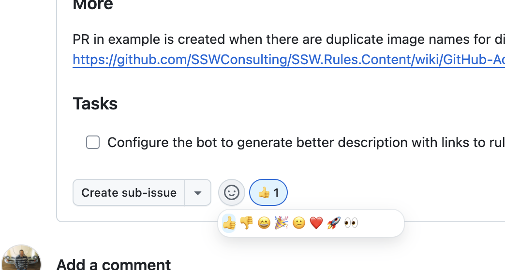
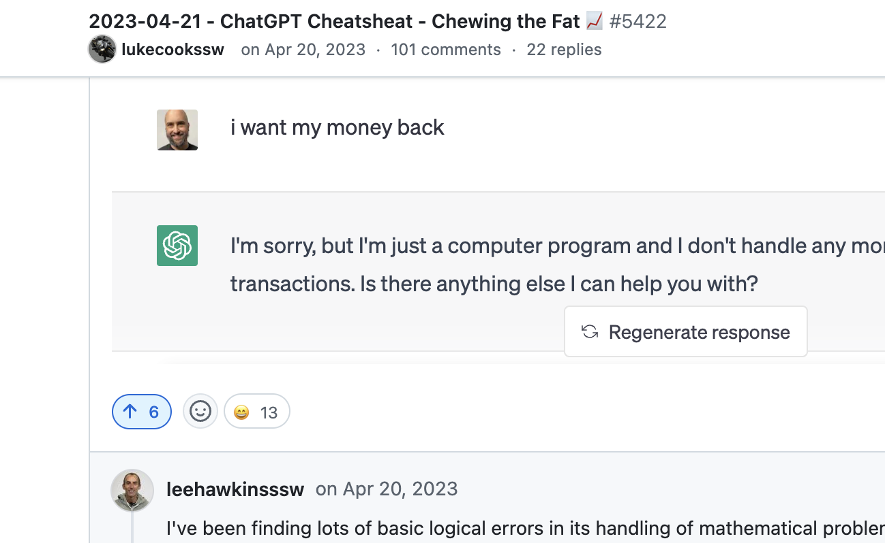

Reacting to GitHub Issues and Discussions is a simple yet powerful way to show that you've seen and acknowledged a report or suggestion. 

When maintainers or contributors use reactions, it signals to the original poster and the community that their input has been noticed, even if a full response isn't immediate.

<!--endintro-->

::: img-medium

:::

A quick 👍, 👀, or ❤️ can keep discussions more engaging, reducing uncertainty about whether some feedback is being considered.

## Vote up on GitHub Discussions

With GitHub Discussions, voting up adds an extra layer of valuable feedback. Maintainers can see what the community prioritizes most, making it easier to focus on high-impact requests. 

::: img-medium

:::

By embracing interactions to GitHub Issues and Discussions, teams create a more responsive and organized backlog, strengthening collaboration and keeping the project moving forward.

::: info
**Note:** For more detailed feedback, **comments** are the best way to provide deeper insights and should be encouraged.
:::
