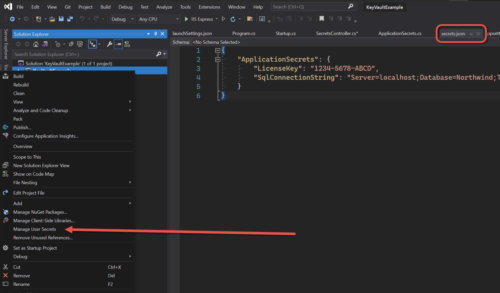
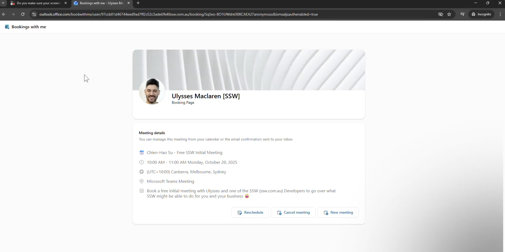
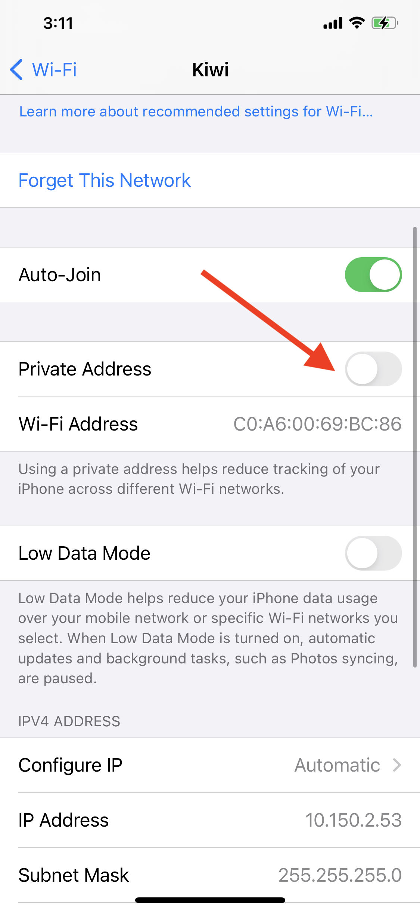
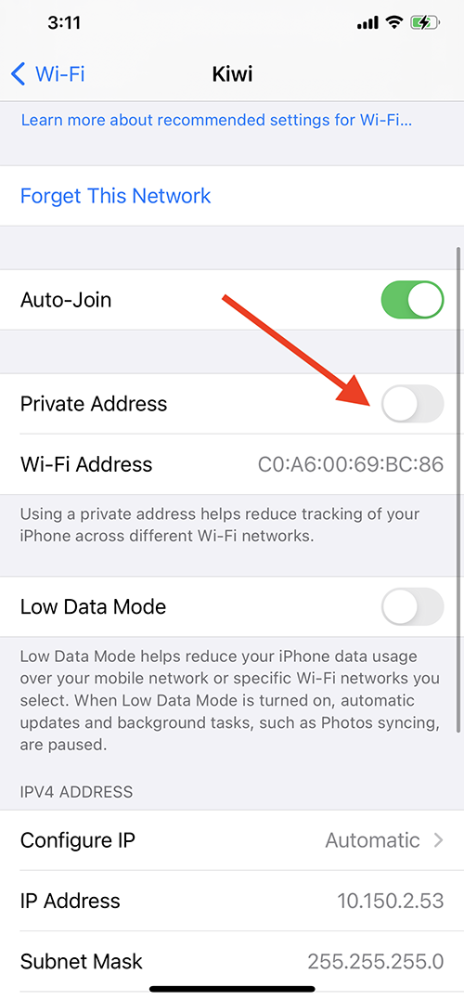

creenshots are a great way to explain instructions or share information, but if they’re blurry or too small, they quickly become useless. With so many different devices, screens, and resolutions, unreadable screenshots are a common mistake.

Always check that your screenshots are clear, properly cropped, and readable. If people can’t see what you’re showing, your message gets lost.

<!--endintro-->

## Only keep what is relevant

Crop your image when you can, keeping only the relevant areas of the image.

In the cases where you do need a full screenshot, it's a good idea to allow users to open the image in a bigger size, [using lightboxes](https://www.w3schools.com/howto/howto_js_lightbox.asp) for example.

::: bad

:::

::: good

:::

## Minimize white space

To reduce white space and make screenshots easier better to capture, resize the browser to show the most relevant content.

::: info
**Tip:** In a PC, press `Windows + Left Arrow` to split your screen and snap your browser to one side.
:::

::: bad

:::

::: good

:::

## Mobile screenshots

Most times screenshots bad readability is caused by too small texts in images, however too big images can also make it difficult for the reader to follow.

Modern mobile devices have extraordinary screen resolution, which makes screenshots huge. Another problem is that these screenshots are in usually in portrait dimensions (image is taller than it is wider).

When adding a mobile screenshot, make sure its width is about 50% of a desktop screen.

::: bad

:::

::: good

:::
