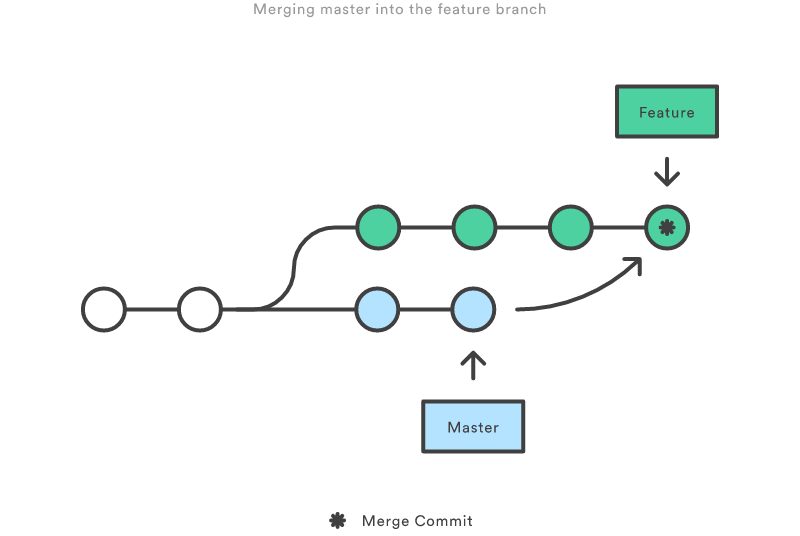
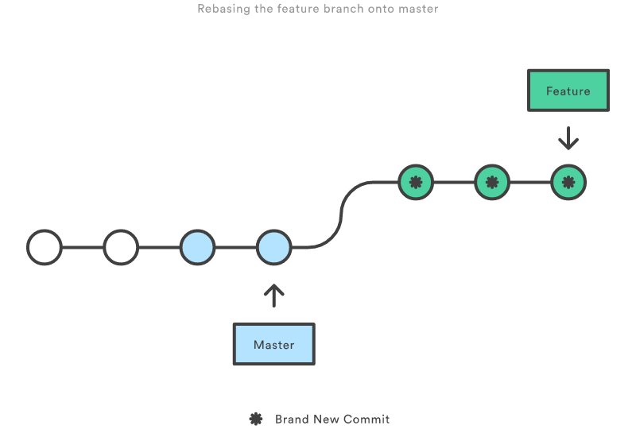

When you merge a branch you end up with messy merge commits.

Rebasing might take a bit to get your head around, but you get a much cleaner project history.

<!--endintro-->

- it eliminates the unnecessary merge commits required by git merge
- rebasing also results in a perfectly linear project history - you can follow the tip of feature all the way to the beginning of the project without any forks.

This makes it easier to navigate your project with commands like git log, git bisect, and gitk.

**Warning:** If you don’t follow [the Golden Rule of Rebasing](/the-golden-rule-of-rebasing), you could end up in a world of pain.
