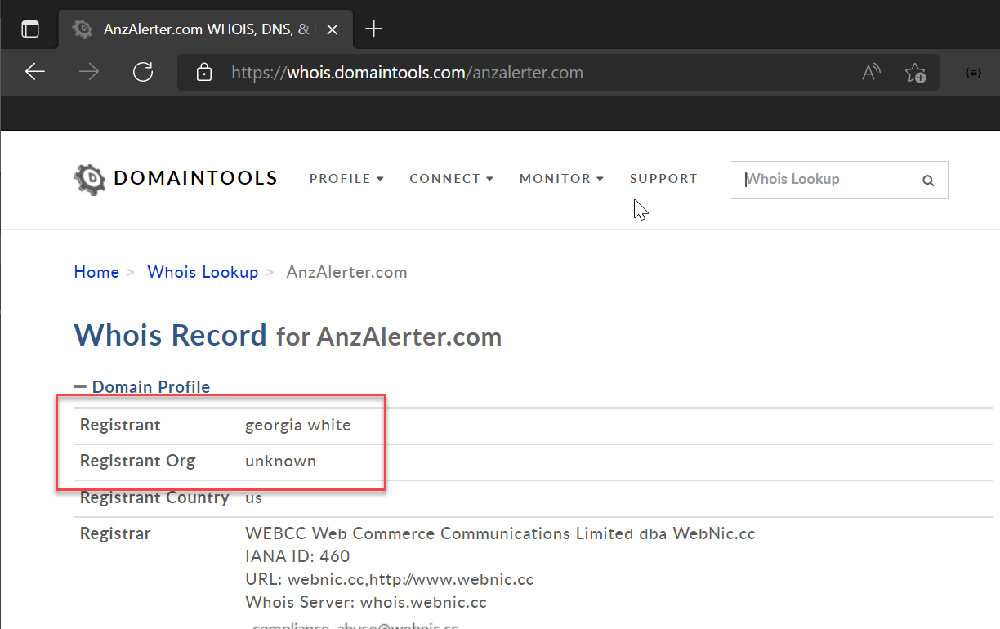
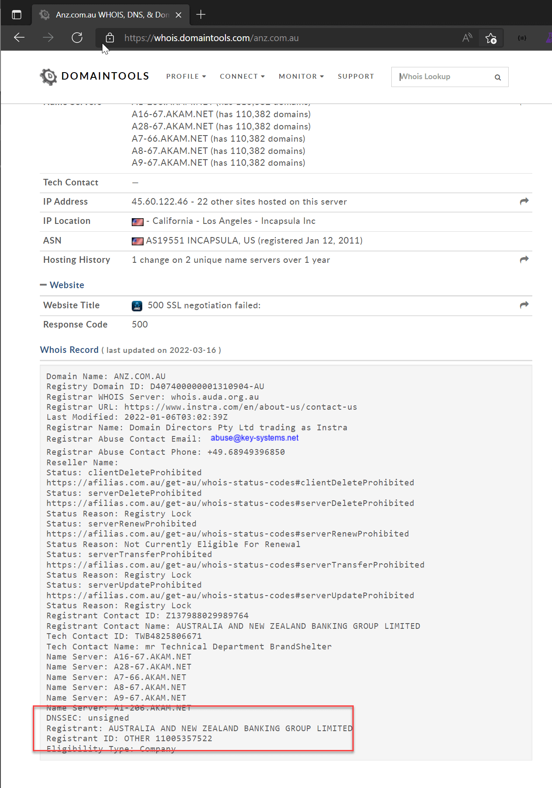

Phishing is a form of social engineering where an attacker tried to convince victim that a resource they are in control of is a legitimate resource. This can be either an email address or a website.

Attackers will often craft a website that looks like a legitimate one for the sole purpose of stealing your username and password (or some other sensitive information). They might, for example, build a website that looks exactly like LinkedIn, so that you think you are logging into LinkedIn, but are in fact giving an attacker your username and password.

<!--endintro-->

A URL is made up of a fully-qualified domain name (FQDN) and a path. The FQDN is the part between the https:// and the next /. Anything after the / is part of the path and not the FQDN.

The FQDN is made up of a top-level domain (TLD), a domain, and then a subdomain or subdomains. These move from right to left, so for the address <https://www.ssw.com.au/>, .com.au is the TLD, ssw is the domain, and www is a subdomain.

For the address <https://www.ssw.com.au/services>, services is the path. The path can include all kinds of other characters and parameters.

You should always check that the **domain** matches the service or website you are expecting.

<http://linkedin.com.sggr.ru/someaddress>

❌Bad example – the address has LinkedIn in it, but it is a sub-domain, not the domain

 

<http://linked-in-hq.com/linkedin/myprofile>

❌Bad example – the address has LinkedIn in it, but it is in the path, not the FQDN. The FQDN is also suspicious.

 

[http://linkedinalerter.com](http://anzalertercom/)

❌Bad example – the address has LinkedIn in it, but is not a legitimate LinkedIn site.

 

 

<http://linkedin.com/someaddress>

✔Good example – LinkedIn is the domain

 

If you are curious about a URL, and think it might be legitimate, you can check the Whois record to see who owns the domain. A useful tool for this is <https://whois.domaintools.com>

