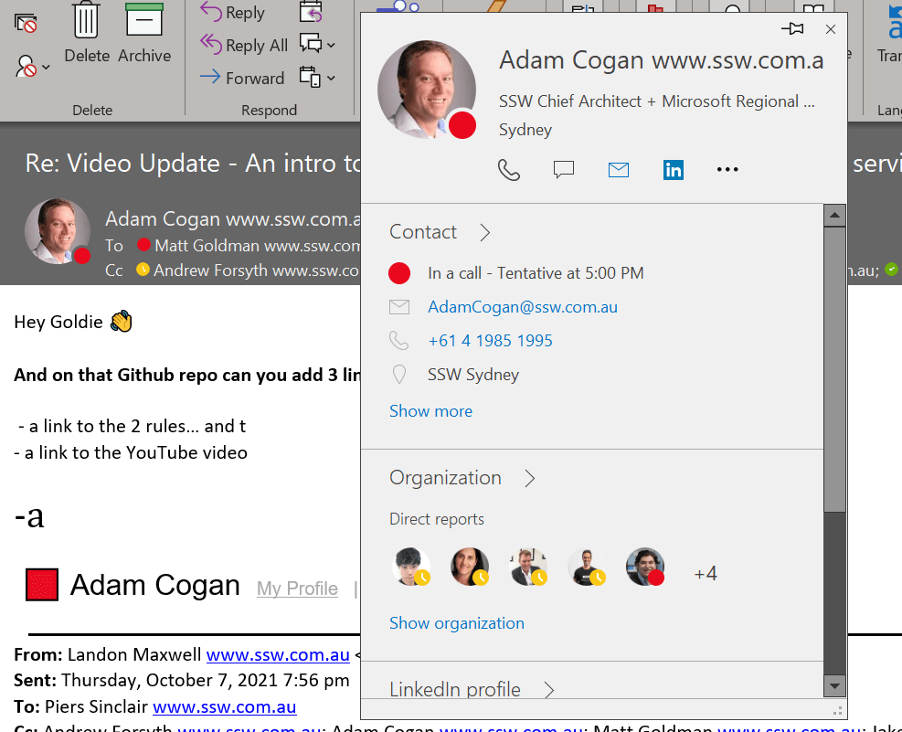
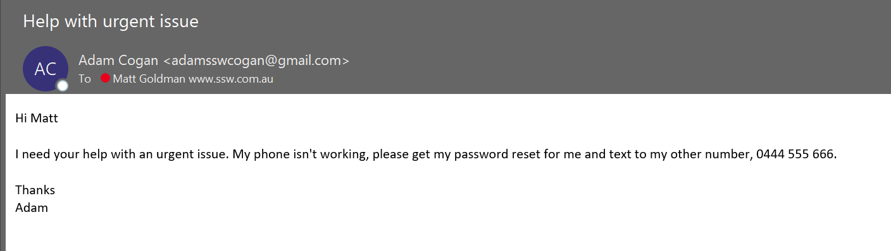
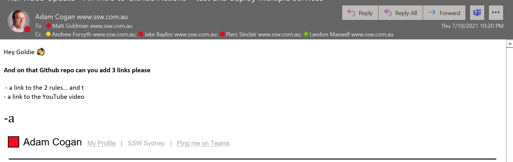

The most common attach vector for hackers to either compromise our computers or deliver malware is email. Some of these attacks are sophisticated, perpetrated by well-funded criminal organizations. But these are rare, and usually targeted at a specific individual for a specific purpose.

<!--endintro-->

Most email scams are actually quite easy to spot, and this is deliberate. People who fall prey to simple scamming techniques are easier targets, whereas people who require more sophisticated techniques to fool, are more likely to recognize a scam later in the process.

These simple techniques will help you identify scams and avoid falling prey to attackers.

### Tip #1: Be wary of unsolicited emails

An unsolicited email is an email that you weren’t expecting. For example, a popular scam a few years ago was to send an email purportedly from the postal service, claiming you have an undelivered package. The recipient was directed to click on a button or link in the email to arrange redelivery.

Another popular scam was an email claiming to be a parking or speeding fine. While these can be scary, and often people want to resolve them as soon as possible, it’s important to take a breather and remember that neither these nor missed delivery notifications get sent by email.

### Tip #2: Check the email address (and not just the name)

When you send or receive an email, the recipient lists an email address and a friendly name. The friendly name can be changed to whatever you like, without impacting where the email comes from.

It’s important to note that this is just one tool in your arsenal. Attackers can spoof email addresses too, so if you have any doubts, you should ask your SysAdmins to help you check the message headers, or do a message trace for you. But an incorrect email address is a dead giveaway.

### Tip #3: Be wary of language used

### Tip #4: Never open attachments that you are not 100% certain of

If you receive an unsolicited email asking you to open an attachment you should delete and ignore it (or report it to your SysAdmins or security team if you have additional concerns).

There may be some cases where you have a suspicion that the email may be legitimate. In these cases, DO NOT reply to the email asking them to confirm (see the section below on checking mailbox rules). Instead, contact the sender via another means (e.g. call them on the phone or on Teams). Only open the attachment or click on the link if you are 100% certain, having verified with the sender, that the email is legitimate.

### Tip #5: Check the URL of links (see related rule)

Malicious emails these days often include a link that the recipient is directed to click on. This can sometimes be to a phishing site, and sometimes it’s a link to some malware (e.g., ransomware which will encrypt all the recipients’ files, plus those on any shares they have access to, demanding a ransom to unencrypt them). Linking to malware avoids them having to worry about the malware being stripped out by malware filters in the email system.

Before clicking on a link in an email, hover over it to see where it goes. See our rule: … to check whether the link is legitimate.

### Tip #6: Legitimate services will never ask for your password

You will never receive a legitimate email asking you to disclose your password (or any other sensitive information for that matter). An email that asks for your password, or asks you to click on a link to ‘confirm’ your password, is a scam and should be deleted immediately (and reported if advised to in your corporate security policy).

### Tip #7: Check your mailbox rules

A particularly nefarious scam is for an attacker to take control of your mailbox, but hide rather than changing the password and locking you out. By not alerting you to their presence, they can squat there for longer and do more damage. A common scenario is to email your contacts and ask them to change their payment details for any invoices to an account controlled by the attacker.

When they do this, they will often create a sub-folder in your mailbox that you don’t know about, then set up a rule redirecting any incoming mail to that folder. That way, if someone replies asking them to verify the legitimacy of the email, the attacker can intercept it and reply without you even knowing.

If you have any reason to suspect any strange activity in your account, check your mailbox rules for anything suspicious. If you discover any rules, delete them, check the sub-folder they were directing messages to, and check your sent items for anything they may have sent out without you knowing. And, of course, change your password immediately.
