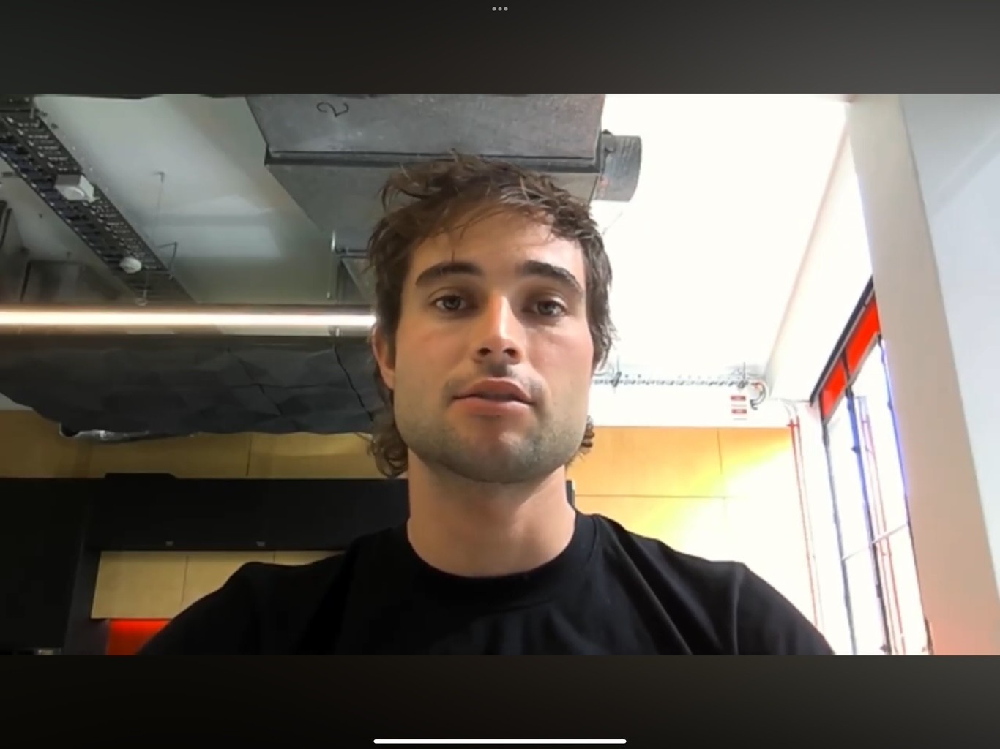
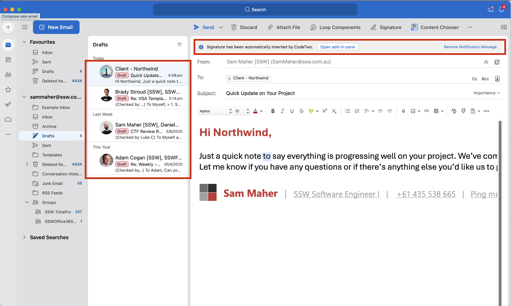
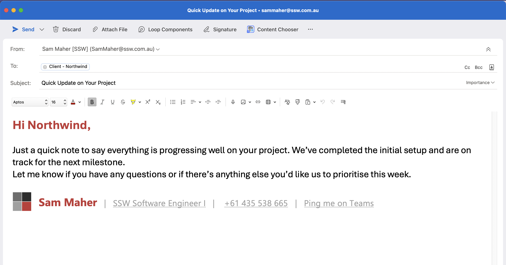

When you've finished a PBI you should record a video to send to your Product Owner and anyone else that is interested. A 'Done' video is much better than a screenshot because you are proving the PBI workflow actually works. Even better, this video can double as documentation or release notes for your users.

<!--endintro-->

When deciding whether a PBI might be a good contender to record a Done Video for, consider these factors:

1. Is it a key piece of functionality that has high business value?
2. Would it be difficult to quickly demo in the Sprint Review without a video?
3. Is it UI heavy? i.e. Would the video be compelling?

::: greybox

**Choosing software to record your screen and camera together:**

Check out SSW Rule [Do you know how to record your screen?](/recording-screen) for the best options.

**Choosing software to edit your video:**

* Basic editing: Clipchamp, Video Editor (for Windows), iMovie (for Mac)
* Advanced editing: Adobe Premiere Pro, Final Cut, DaVinci Resolve

:::

### For a quick and dirty 'Done Video'

Your done videos should follow the following format

1. **Intro**
   * Prepare and practise your talking points and visual elements
   * Start with a medium close up shot of yourself
   * Start with a smile the camera for 2 seconds before speaking
   * Briefly introduce yourself e.g. first name, role, "from SSW"
2. **Post-intro**
   * Transition into a screen share with the solution you've created on screen, moving your portrait shot to the bottom right corner of the screen
   * Provide an overview of the PBI you are going to discuss, remembering to zoom out before showing code samples or demos (see rule - [Do you zoom out then in](https://www.ssw.com.au/rules/zooming-in-and-out/))
   * You should start with the tabs you are planning to use open
3. **Show the Pain**
   * Explain the problem you or the stakeholder was having before you finished your work
   * Show a example of where this issue occurred
4. **Demo the solution**
   * Provide a working example of your code
   * Demo the code with a realistic use case
   * Direct attention and give people an idea of where to look
   * Harken back to the pain showing the value of your solution
5. **Outro**
   * Transition back into a medium close up shot of yourself
   * Provide a brief summary of what you discussed in the video
   * Use a signature to bid farewell to the audience (e.g. you could say "This is Bob Northwind signing off")
   * Hold eye contact and a smile to the camera for 2 seconds before the video ends

Here's a video describing how to record and edit a quick Done video using Clipchamp:

**Tip:** Jump to 04:31 for how to record screen and webcam.

`youtube: https://www.youtube.com/embed/mBoSJpRm7gk`

:::info

Warning: Clipchamp has a record limit of 30 minutes for a single project. If you are planning on recording several takes, start a new project.

:::

**Video: BEST Clipchamp Video Editing Tips and Tricks (14 min)**

Here's a video describing how to record a quick Done video using OBS:

`youtube: https://www.youtube.com/embed/uL8BwstqiqE`

**Video: How to Record your Computer Screen & Webcam in OBS Studio (8 min)**

**Note:** The Picture in Picture will be permanently embedded in the exported video and cannot be altered later.

### For a more professional video that requires some editing

Here's a quick video describing how to record your webcam and screen separately in high-resolution using OBS for post-processing and editing:

`youtube: https://www.youtube.com/embed/N2Pc93zK-Vw`

**Video: How to Record Webcam and Game Separately in OBS Studio | Tutorial (10 min)**

**Note:** You will be able to alter the PIP, remove it, go full screen on your face. Also note that you'll need to **set the output to 30 FPS** in your OBS settings - not 60 FPS as outlined in the video. Setting the output to 30 FPS will ensure you don't experience syncing issues or lag between the video and audio.

Switching Scenes in OBS - it is quite easy to do with these simple steps using OBS Hotkeys!

`youtube: https://www.youtube.com/embed/vr8WyM12qC8`

**Video: How To Switch Scenes In OBS Easily! (OBS Hotkeys) | Tutorial (4 min)**

## Presentation

1. **Apparel** - If your company has branded clothing, make sure it's ironed, tidy and visible. Wear it proudly! Alternatively, wear clean, neutral color clothing. E.g. White, grey, or black shirt
2. **Framing** - Have your webcam height at eye level for engagement. Make sure there is sufficient headroom: not too little (don't cut off the top of your head in the frame) and no too much (the subject needs to fill the frame). Ensure your branded clothing is visible and the background is clean and tidy, also consider tilting the camera for a more dynamic background with depth instead of a flat background.

::: bad

:::

::: good

:::

3. **Lighting** - Ensure there is optimal room lighting and facial brightness. Consider a ceiling-pointing lamp for additional light. Avoid intense backlights to prevent silhouetting.
4. **One-Take** - Record it in one take, but start again if it's super bad. If something out-of-your control happens, try to be natural! If you mistype a word or click the wrong button, don't freak out and start again, incorporate it. E.g. *"Whoops, clicked build accidently. Let me just refresh and go again."*

::: info
If your video is short (1-2 mins), then starting again may be optimal. However, if your video is long. E.g. 15-20 minutes, then try to incorporate any accidental errors and keep going.
:::

5. **Clean UI** - When using a browser, IDE, or any relevant application, ensure a clean interface:

   * For your browser, hide the bookmarks bar and set the zoom to 125%. (You can easily get a clean browser by using a guest or incognito profile)
   * If presenting in Microsoft Office, hide the ribbon.
   * When using Outlook for presentations, clear any irrelevant reminders.
   * When using Outlook or Teams, clear messages and notifications to avoid sharing sensitive information.

::: bad

:::

::: good

:::

6. **Resolution** - Set your screen to 1080p (1920x1080).
7. **Recording** - Record both your screen and webcam.
8. **Audio** - Check your audio devices for the best quality and make sure your audio is clear and not distracting. E.g. Position the microphone close to your mouth.
9. **Be Friendly** - Interact with your webcam like it's a person, and smile at the Intro and Outro.
10. **Do a Test Recording** - After all this effort to capture a great video this can catch any last-minute changes and cut down on potential re-recordings. E.g. Test your Intro hook and screen transitions.

Remember to watch some "Done" videos to get an idea of what a good "Done Video" looks like!

`youtube: https://www.youtube.com/embed/DnNTaS7lYZY`

::: good
**Video: Good example - Record yourself and your screen | Tables in TinaCMS (2 min)**
:::

::: info
Looking to improve your presentation skills?

Once you've followed the steps above to set up your device and you are ready to record, see our tips here to [craft and deliver engaging presentations](/craft-and-deliver-engaging-presentations)
:::
