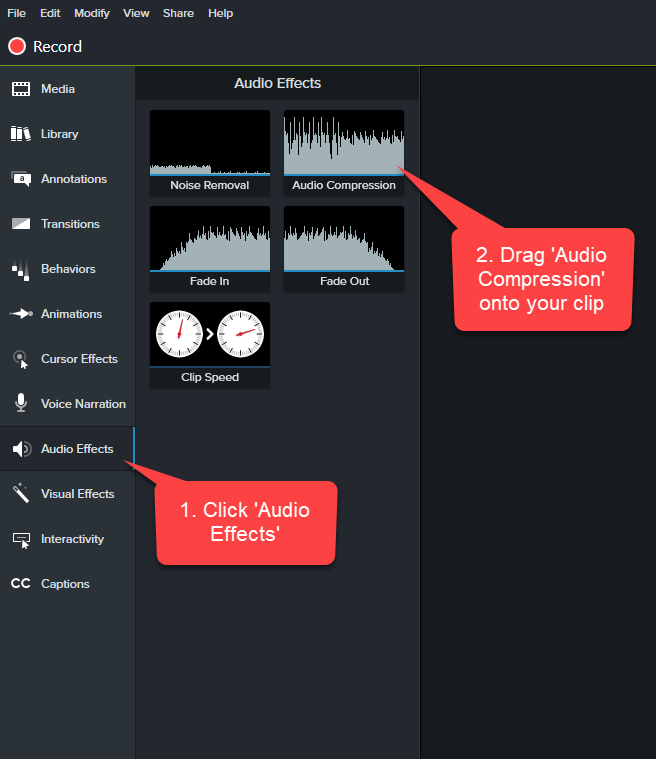
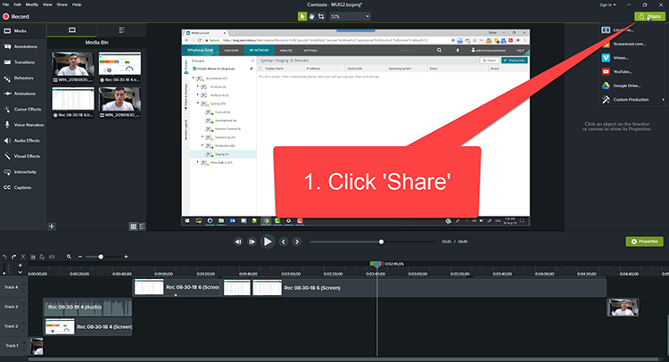
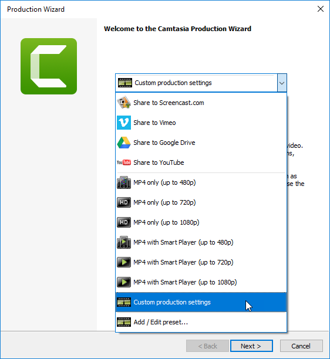
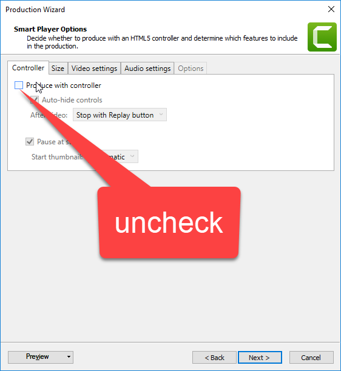
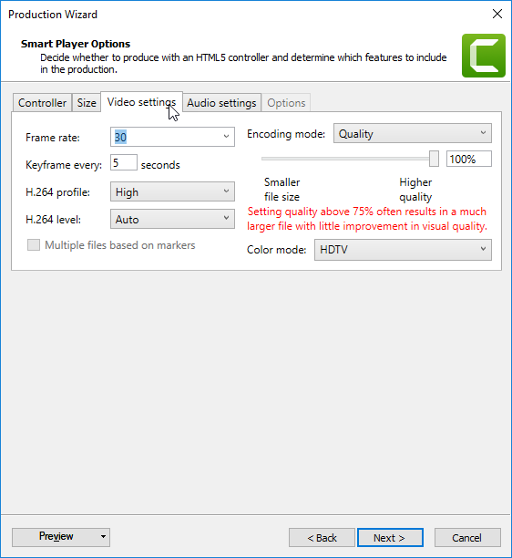
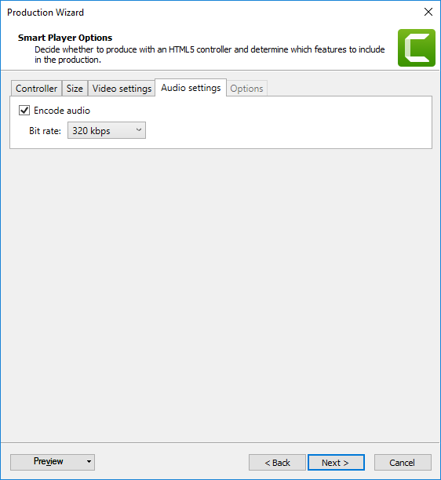

When you've finished a PBI you should record a video to send to your Product Owner and anyone else that is interested. A 'Done' video is much better than a screenshot because you are proving the PBI workflow actually works. Even better, this video can double as documentation or release notes for your users.

<!--endintro-->

When deciding whether a PBI might be a good contender to record a Done video for, consider these factors:

1. Is it a key piece of functionality that has high business value?
2. Would it be difficult to quickly demo in the Sprint Review without a video?
3. Is it UI heavy? i.e. Would the video be compelling?

::: greybox

**Choosing software to record your screen and camera together:**

* Remote recordings: [Zoom](https://zoom.us), [Microsoft Teams](https://www.microsoft.com/en-au/microsoft-teams) via [NDI](https://www.ndi.tv),  [StreamYard](https://streamyard.com) (advanced)
* Basic recordings: [Snagit](https://www.techsmith.com/screen-capture.html), [Loom](https://www.loom.com),
* Advanced recordings: [Clipchamp](https://clipchamp.com/en/), [OBS Studio](https://obsproject.com), [Camtasia](https://www.techsmith.com/store/camtasia),

**Tip #1:** Clipchamp is recommended because it is easy to use both for recording and editing, completely free, and offer direct uploads to YouTube.

**Tip #2:** Zoom, and Microsoft Teams are cloud-based services, so consider whether an option such as Snagit, Loom or Clipchamp that records locally is more appropriate. **If you record with Zoom, post-production editing will be required**. 

**Choosing software to edit your video:**

* Basic editing: Video Editor (for Windows), iMovie (for Mac)
* Advanced editing: Adobe Premiere Pro, Final Cut, DaVinci Resolve

:::

### For a Quick and Dirty Done Video

Here's a video describing how to record and edit a quick Done video using Clipchamp:  
Tip: Jump to 04:31 for how to record screen and webcam.

`youtube: https://www.youtube.com/embed/mBoSJpRm7gk`

**Video: BEST Clipchamp Video Editing Tips and Tricks (14 min)**

Here's a video describing how to record a quick Done video using OBS:

`youtube: https://www.youtube.com/embed/uL8BwstqiqE`

**Video: How to Record your Computer Screen & Webcam in OBS Studio (8 min)**

Note: The PIP will be baked in and cannot be altered later.

### For a more professional video that requires some editing

Here's a quick video describing how to record your webcam and screen separately in high-resolution using OBS for post-processing and editing:

`youtube: https://www.youtube.com/embed/N2Pc93zK-Vw`

**Video: How to Record Webcam and Game Separately in OBS Studio | Tutorial (10 min)**

Note: You will be able to alter the PIP, remove it, go full screen on your face... whatever 

Switching Scenes in OBS - it is quite easy to do with these simple steps using OBS Hotkeys!

`youtube: https://www.youtube.com/embed/vr8WyM12qC8`

**Video: How To Switch Scenes In OBS Easily! (OBS Hotkeys) | Tutorial (4 min)**

Here's a quick video describing how to record and edit a quick Done video using Camtasia. 

`youtube: https://www.youtube.com/embed/CjwkGk1LcJ0`

**Video: Make a Quick and Dirty "Done" video in Camtasia (2 min)** 

### Camtasia Tips

#### Tip #1: Camtasia - See great example by Ben Cull

E.g. A real example of a 'Done Video' with fades:

`youtube: https://www.youtube.com/embed/nG4IAxdEWQg`

**Video: SSW TimePRO - Power BI Ad-Hoc Reporting (4 min)** 

#### Tip #2: Camtasia - Fix the audio before making any cuts to the video

After recording your video, you need to do some basic sound processing to make the audio awesome.

* In the Timeline, select the clip with the audio
* On the top left panel, click ‘Audio Effects’ and drag the ‘Levelling’ effect onto your clip
* On the timeline, move the new audio meter up just until the audio waveform is about to hit the top
* Listen and adjust as necessary

    

#### Tip #3: Camtasia - Fade-out and fade-in the video track of your face

1. With the video track of your face selected, click on **Animations (1)**. Track 3 in the image below.
2. Select the  **No Opacity (2)** animation effect for the fade-out.
3. **Drag and drop the No Opacity effect (3)** to the point in the track where you want to fade-out. Adjust the start and end point of the fade using the handles on the animation arrow.
4. Select the  **Full Opacity (4)** animation effect for fade-in.
5. **Drag and drop the Full Opacity effect (5)** to the point in the track where you want to fade-in. Adjust the start and end point of the fade using the handles on the animation arrow.

#### Tip #4: Camtasia's Final Step – Export your video

Follow the steps to export your video:

1. Click the Share button on the top right of the window

   
2. In the new dialog, select 'Custom production settings':

   
3. In the next window, uncheck the ‘Produce with controller’ option: 

   
4. In the ‘Video settings’ tab, copy these settings:

* Frame Rate: 30
* H.264 Profile: High
* Encoding mode: Quality
* Increase the quality to 100%

   

5. In the ‘Audio settings’ tab, make sure the Bit rate is set to 320 kbps:

   
6. Click Next and save your file!

### Example of a good Done Video

`youtube: https://www.youtube.com/embed/OhVYTOKCsWI`

::: good
**Video: Good example - Record yourself and your screen | SSW Error Handler (4 min)**
:::

::: info
Looking to improve your videos?

Once you've followed the steps above to set up your device and you are ready to record, see our tips here for [the key steps to make a great 'Done Video'](/making-a-great-done-video)
:::
