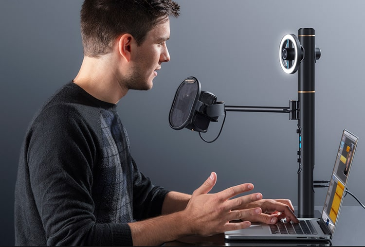
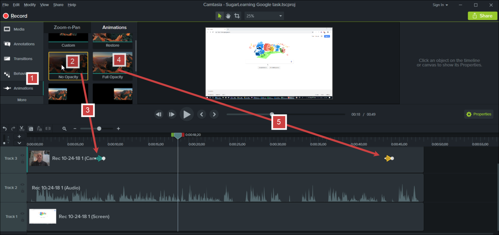

When you've finished a PBI you should record a video to send to your Product Owner and anyone else that is interested. A 'Done' video is much better than a screenshot because you are proving the PBI workflow actually works. Even better, this video can double as documentation or release notes for your users.

<!--endintro-->

When deciding whether a PBI might be a good contender to record a done video for, consider these factors:

1. Is it a key piece of functionality that has high business value?
2. Would it be difficult to quickly demo in the Sprint Review without a video?
3. Is it UI heavy? i.e. would the video be compelling?

::: greybox
**Choosing software to record your screen and camera together:**

* Remote recordings: Zoom, or Microsoft Teams via NDI 
* Basic recordings: Snagit, Loom
* Advanced recordings: Camtasia

**Tip:** [Camtasia 2021](https://www.techsmith.com/camtasia-2021-press-release.html) is recommended because it vastly improves upon 2018 and 2019. 

**Tip:** Both Zoom and Microsoft Teams are Cloud services, so consider whether an option such as Camtasia that records locally is more appropriate.

:::

::: greybox
**Choosing software to edit your video:**

* Basic editing: Camtasia
* Advanced editing: Adobe Premiere Pro, Final Cut, DaVinci Resolve
  :::

Here's a quick video describing how to record and edit a quick done video. (Notice how it itself is also in the done video format?)

`youtube: https://www.youtube.com/embed/CjwkGk1LcJ0`

**Figure: How to make a 'Done Video'.** 

### For a great 'Done Video' here are the key things to remember:

* Introduce the video - start with “Hi everyone, today I would like to show you xxxx”.
* Show the pain - don't just demonstrate your new feature, start by showing the problem you are solving and why you needed to add the feature.
* Record it in one take - it doesn't matter if you stuff up or something goes wrong, treat it like you're having a conversation with them in the room. If it's super bad, just start again.
* Make it quick and easy - if you spend too much time, you will be less likely to want to do it again in the future.
* Be quick and concise - you don't want to waste other peoples' time either!
* Use a clean browser - hide visible bookmark bars, browser tabs, add-in icons, and taskbar items to make it easier to view. 

  * **Tip:** In Chrome you can use the "guest" profile to open a clean window with no history or cookies.
* Set your screen resolution to 1080p (1920x1080) - higher resolutions (e.g. 4k/3840x2160) will scale down graphic elements and make it harder to view.                  
* Zoom in to 125% in your browser - as per: [Do you make sure your screen recordings are easy to view?](https://www.ssw.com.au/rules/easy-to-view-screen-recordings)
* Record both your screen and webcam - PC and Mac can both use Camtasia (2021 version recommended). For Mac you can use Quicktime, but it’s not as flexible. Zoom and Teams record both by default.

  * **Tip:** If you're using Zoom, turn on HD recording (720p or 1080p depending on your plan) in Settings | Video | Camera | HD.
* Don't edit the video - your introduction and closing should have your webcam on full-screen, and the rest of the video should be your screen with your webcam in the corner (also called a picture-in-picture, or PiP).

  * **Tip:** If you are using Zoom you do not need to edit the video. Zoom includes your face automatically in the screen capture. Awesome!
* [Check your audio devices](https://www.ssw.com.au/rules/record-better-audio) - if you have multiple microphones (e.g. headphone/mic set, webcam mic, inbuilt mic, etc.) do a test recording to see which is the best quality.

  * **Tip:** You can use the default Voice Recorder app on either Windows or Mac to quickly record audio.
* Audio needs to be clear and not distracting - if there are lots of background noises it will prevent audiences from focusing on you, as per: [Do you record better audio?](https://www.ssw.com.au/rules/record-better-audio)
* Interact with your webcam like it's a person - look into the camera and smile when doing your introduction and closing for the video!

**Tip:** Some offices have a professional setup:

  E.g. SSW have the **Marantz Turret** hardware and desktop recording kit. The Turret is an ideal device to record these videos as it has a professional podcasting microphone, built-in light and good quality High Definition video camera.

\
Learn more about the Turret:[Product Review: The Marantz Turret — Wistia](https://wistia.com/learn/production/marantz-turret-review?wvideo=whmpjct7xj)    

### \-- Camtasia Tips --

### Tip #1: Camtasia - See great example by Ben Cull

E.g. SSW TimePRO - Power BI Ad-Hoc Reporting:

`youtube: https://www.youtube.com/embed/nG4IAxdEWQg`

**Figure: A real example of a 'Done Video' with Fades** 

### Tip #2: Camtasia - Fix the audio before making any cuts to the video

After recording your video, you need to do some basic sound processing to make the audio awesome.

* In the Timeline, select the clip with the audio
* On the top left panel, click ‘Audio Effects’ and drag the ‘Levelling’ effect onto your clip
* On the timeline, move the new audio meter up just until the audio waveform is about to hit the top
* Listen and adjust as necessary

### Tip #3: Camtasia 9 - Fade-out and fade-in the video track of your face

1. With the video track of your face selected, click on  **Animations (1)** . Track 3 in the image below.
2. Select the  **No Opacity (2)** animation effect for the fade-out.
3. **Drag and drop the No Opacity effect (3)** to the point in the track where you want to fade-out. Adjust the start and end point of the fade using the handles on the animation arrow.
4. Select the  **Full Opacity (4)** animation effect for fade-in.
5. **Drag and drop the Full Opacity effect (5)** to the point in the track where you want to fade-in. Adjust the start  and end point of the fade using the handles on the animation arrow.

### Tip #4: Camtasia's Final Step – Export your video

Follow the steps to export your video:

1. Click the Share button on the top right of the window

  

2. In the new dialog, select custom production settings 

  

3. In the next window, uncheck the ‘Produce with controller’ option 

  

4. In the ‘Video settings’ tab, copy these settings:

* Frame Rate: 30
* H.264 Profile: High
* Encoding mode: Quality
  o	Increase the quality to 100% 

  

5. In the ‘Audio settings’ tab, make sure the Bit rate is set to 320 kbps 

  

6. Click Next and save your file!