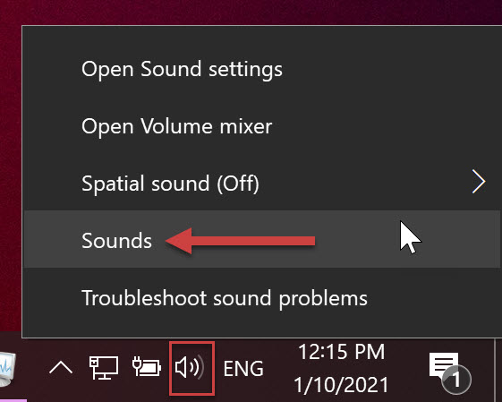
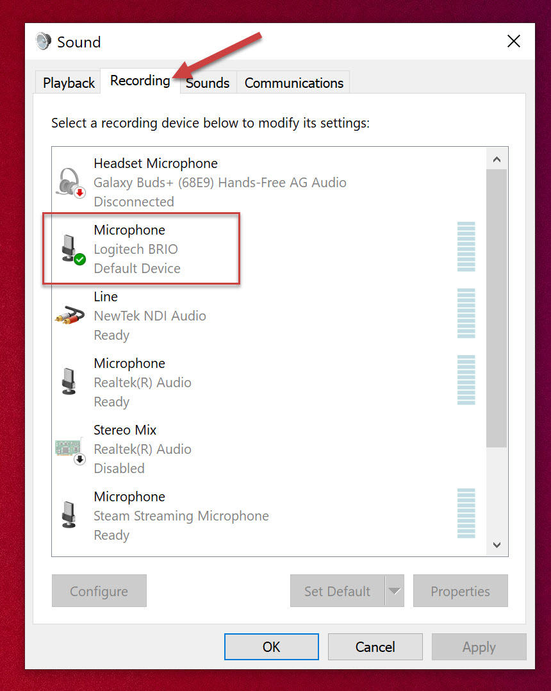

Audio is one of the most important things to get right in a video as many viewers will tune out if the sound is not good, because if you can't hear someone properly it makes it more difficult to understand them.

<!--endintro-->

### Background Noise

Having sounds in the background during a recording can be very distracting, and sometimes irritating to a viewer, e.g. construction, traffic, someone in the kitchen banging pots and pans.

Try these tips to minimize unwanted noise:

1. Timing – schedule your recording during a quiet part of the day (e.g. avoid meal-times and breaks)
2. Block out & dampen sounds – reduce the amount of noise by physically obstructing it:

   * Close all doors and windows - a sealed space will reduce a large amount of noise
   * Create a barrier – put obstacles in between your microphone and the unwanted noise (e.g. use a wall divider, or stack some boxes to make a wall)
   * Use Carpet/Rugs – soft materials will cut down on echo and ambient noise
3. Mic distance – putting your microphone closer to your audio source will make your desired audio louder, and unwanted noise will be less noticeable

### Silent Spaces – Record “Room Tone”

Room Tone is the ambient noise in a room when no sound is being produced, like a room’s audio fingerprint.
The sound is shaped by many things, including the room’s size, shape, and objects, as well as noise created from appliances, e.g. refrigerators.

As these sounds are constant and consistent, editing software that can remove a lot of this noise, making your audio recordings much nicer.
Having these spaces will also make editing much easier, (e.g. Intro and Outro graphics can fade in over these spaces)

1. When you start recording, wait 30 seconds before you begin.
2. When you finish your presentation, stay in your position for an extra 30 seconds.
3. Smile! Don’t forget you are still on camera.

### Microphone types

There are several types of microphones, and each has a distinctive shape and a specific way to be used.

* Dynamic - Stage:
  These are robust, cheap, and durable microphones, and recognisable at any live event or gig.
  These use a movable induction coil suspended in the field of a magnet, which is resistant to loud sources, e.g. drumkits and guitar amplifiers.
  For recording vocals, the best position for a dynamic mic is 5-10 cm away from your mouth, with the tip pointed towards your mouth.
* Dynamic - Lapel / Lavalier:
  These have an induction coil like the stage mics, but are very small omnidirectional mics. They can be fixed in a headset, or have a long cable and a clip so it can be easily moved.
  For recording vocals, the best position for a lapel mic is over the sternum.
* Large Diaphragm Condenser - Studio
  Condenser mics have a thin flat membrane, or diaphragm, that moves in reaction to sound pressure. This makes them more sensitive, which can produce a more pleasant sound, but also makes them much more delicate.
  These mics are most receptive when sound reaches the flat surface of the large diaphragm.
  For recording vocals, the best position for a large diaphragm condenser mic is to have the flat side of the diaphragm pointed towards you, e.g. on a Blue Yeti this is indicated by the "Blue" logo.
* Small Diaphragm Condenser - Shotgun
  These condenser mics have a much smaller diaphragm, so are more robust that the large diaphragm mics, but are still very sensitive. The most common type is known as a "shotgun", known for the long barrel that it is mounted in, which are directional.
  For recording vocals, the best position for a mall diaphragm condenser mic, or shotgun mic, is to point the tip of the barrel towards the source.

### Microphone Patterns

Recording Patterns are a way to refer to the most sensitive parts of a microphone – the areas where the most sound will be picked up.
Some high-end microphones will have options for Recording Patterns, including:

* Stereo: uses a left and right channel, so sounds will feel like it coming from a specific location. Good for music.
* Omnidirectional: picks up sound equally from all around the mic. Best for recording multiple speakers.
* Cardioid: picks up sounds directly in front of the microphone. Best for recording a single speaker.
* Bi-Directional: picks up sounds directly in front and behind the microphone. Best for recording in between two speakers.

### Record Locally

When recording a Microsoft Teams or a Zoom call (e.g. an interview) the software will automatically compress the sound, reducing the quality. 
So that your final video has the best sound quality:

1. Check your default recording device is set to the microphone you want to record with:

   * Right-click the sound icon in the taskbar and select "Sounds". (You can also access the panel through by searching "Change system sounds" in the start menu)

   * Select the "Recording" tab, and check that your desired microphone is set to default device.

2. Record the audio locally (e.g. you can use Windows' Voice Recorder app)

3. To access the recording, you can right-click on the file in Voice Recorder and select "Open file location". The default location for Voice Recorder files is in your user Documents folder, e.g. C:\Users\YourAccount\Documents\Sound recordings

This higher quality audio should be used in post-production eg. When editing in Adobe Premiere Pro.

`youtube: https://www.youtube.com/embed/yfbKXqRAgOA`

::: good
Figure: Good example – Brian Tyler Cohen and Adam Schiff – the setup is likely Zoom and a good mic

:::