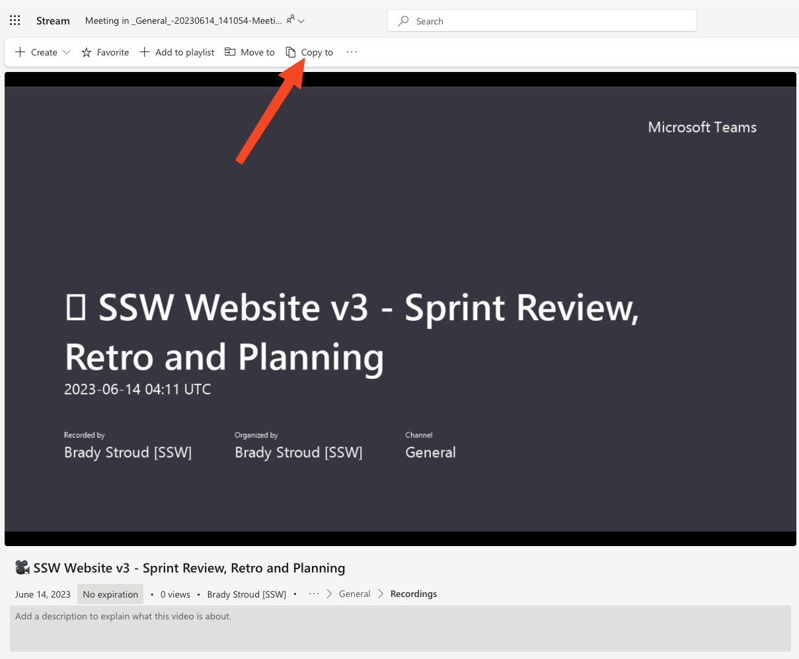
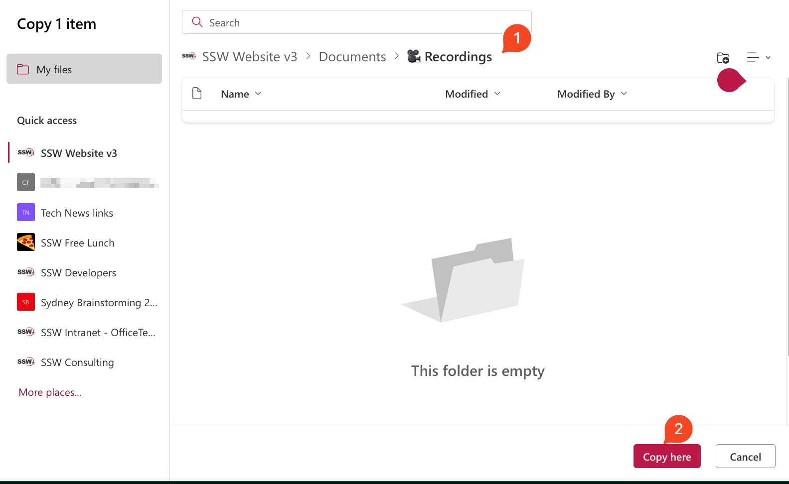

Microsoft Teams makes it super easy to record meetings, whenever you are presenting something important or making impactful decisions, the meeting scribe should 'hit record'.

Before recording, let the attendees know that the meeting will be recorded (Teams has a popup that does this automatically).

## Why record meetings?

* Document decisions - If design decisions are made in a meeting, having a record means you can go back and check what was said.
* Easy to Share - You can send YouTube links to clients or distribute internally
* Training Material - Use the recordings for onboarding or as case studies
* Post-Meeting Analysis - Review to make your next meeting even better
* Remote Inclusion - Helps remote or absent team members stay in the loop (Its always better if they can attend)

## Storing recordings

When you record meetings in Teams, they are stored in Microsoft Stream. Microsoft Stream will delete recordings, so ensure the meeting scribe downloads the recording and uploads it to YouTube. 

After recording find the link to the recording in the meeting chat

1. Click the 'Copy to' button and move the file to a relevant Team's channel

2. Move the recording to a relevant Team's channel

3. If you are going to share the video, upload it to YouTube and send the link