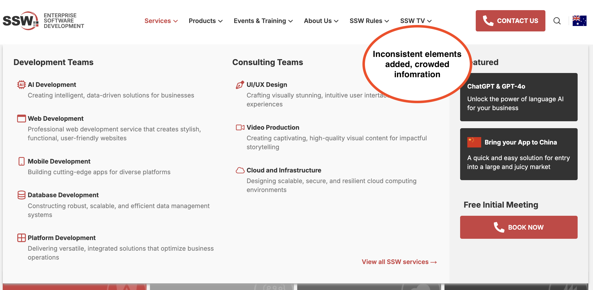

It’s tempting to fix small UI issues on the fly — change a button size, adjust some spacing, or tweak a color. But those “quick wins” often turn into long-term losses, leading to a messy, inconsistent UI that confuses users and slows development.

<!--endintro-->

Design debt is like technical debt: shortcuts that seem efficient in the moment create chaos down the line. Without a shared system, visual inconsistencies multiply, developers second-guess design intent, and user experience suffers.

## What causes design debt?

It usually starts with innocent intentions:

* "Just added a quick icon"
* "Tightened the padding a bit"
* "Didn't want to bother design — it's small"

We’ve all done it. But enough of these add up fast. Suddenly, the product feels inconsistent, design is out of sync, and developers redo work they thought was already done.

## How to prevent design debt

### 1. Before you code

Ask yourself:

* Is this already in the design system?
* Will users see this change?
* Does it affect layout, spacing, interaction, or visuals?

If the answer is “yes” or you’re not sure; it involves design. So ask for a “Test Please” and tag a designer on the PBI before making changes.

### 2. Track it properly

Even small tweaks need visibility:

* Create a PBI for every UI change
* Tag it `needs-design` or `minor-UI` depending on the impact
* Let the PO and designer review and prioritise

### 3. Use the design system

Design systems are like component libraries — but for UI.

* If the component exists, use it.
* If it doesn’t, don’t freestyle. Ask if a new pattern is needed.

Always check with design. No matter what.

## Examples – The SSW Mega Menu

::: greybox
This Menu has had small tweaks added over time: new icons, padding changes, label tweaks — all without a design review.
:::
::: bad

:::

::: greybox
This is the original Menu design — consistent, aligned with the design system, and reviewed by design before implementation.
:::
::: good

:::

## More ways to prevent design debt

* Screenshot your change and post it in Slack before merging
* Ask for a quick designer 👀 on spacing, alignment, and component use
* Loop in design early on bigger stuff (e.g. layout or feature changes)
* After merge, let design know if you created something reusable

## Why design debt matters

### 🚨 Why it happens

* Rushed timelines or MVP mindset (“we’ll fix it later”)
* No shared design system
* Designers and developers working in silos
* Unclear product direction or pivots

### 📉 Why it’s a problem

* Hurts user trust and usability
* Makes the product feel messy or inconsistent
* Slows future development and design
* Causes rework and team friction

### 🧹 How to manage it

* Run regular UX audits and design reviews
* Maintain a living design system or component library
* Include UI refactoring in your roadmap
* Document design decisions with clear rationale

## Treat design like code

Every visual tweak changes the product — just like changing a line of code. So follow process, get the right people involved, and respect the system. 🤖
