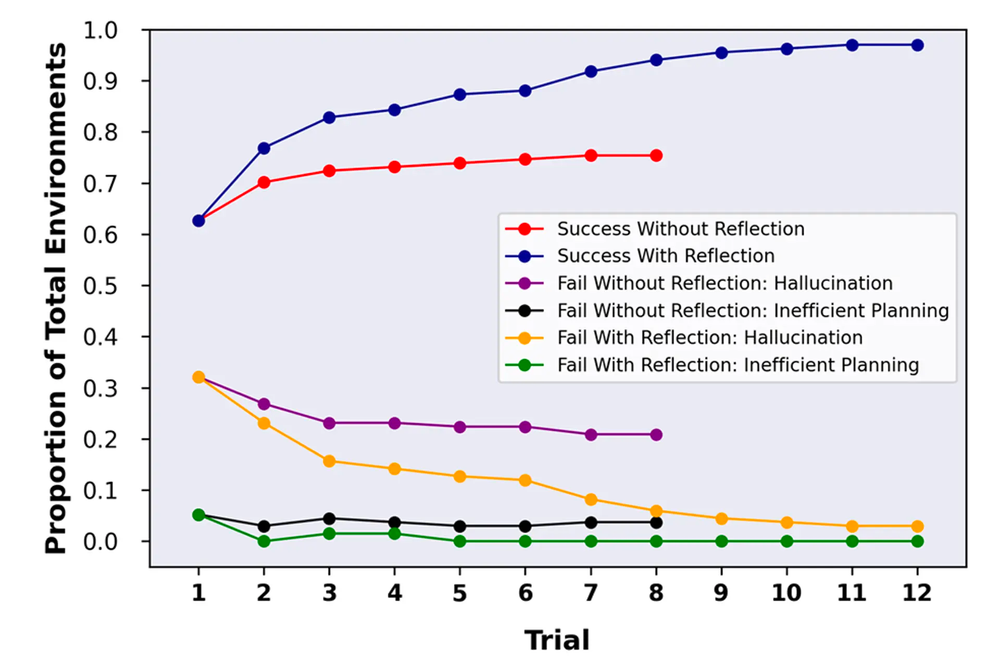

Have you ever received an output from an LLM and wondered if it could be improved? Reflexion is an iterative approach that allows you to fine-tune the model's output by involving the model in the evaluation process itself.

<!--endintro-->

## Why is Reflexion Important?

Reflexion allows for a more human-like iterative problem-solving approach. It enables the LLM to evaluate its own output, thereby offering insights into how it can be improved.

### Steps to Implement Reflexion

1. **Initial Prompt**: Start by asking the LLM to complete a task.
2. **Self-Evaluation**: Use a Reflexion prompt to ask the LLM to rate its own output and provide recommendations for improvement.
3. **Iterate**: Make adjustments based on the LLM's feedback and repeat the process.
4. **Contextual Testing**: Once satisfied, test the improved prompt in a fresh context to remove any lingering biases.

::: greybox
`Write me a recipe for healthy cookies`
:::
::: bad 
Figure: Bad Example {This prompt doesn't engage the LLM in a Reflexion loop and misses the opportunity for iterative improvement.} :::

::: greybox
`Write me a recipe for healthy cookies. Rate the recipe /10 for healthiness and tastiness. Also provide recommendations for improvement.`
:::
::: good 
Figure: Good Example {This prompt initiates a Reflexion loop by asking the LLM to evaluate and critique its own output.} :::

### Comparative Evaluation

You can also use Reflexion to help make decisions, ask the LLM for multiple options and then use Reflexion to assign scores and critical evaluations to each option. These scores will make it easier to decide on the best approach.

## Conclusion

Reflexion is not just a technique but a paradigm shift in how we interact with LLMs. It allows for a more nuanced and iterative approach to problem-solving, closely mirroring human cognitive processes.