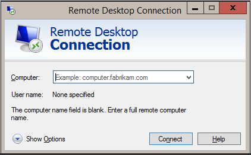
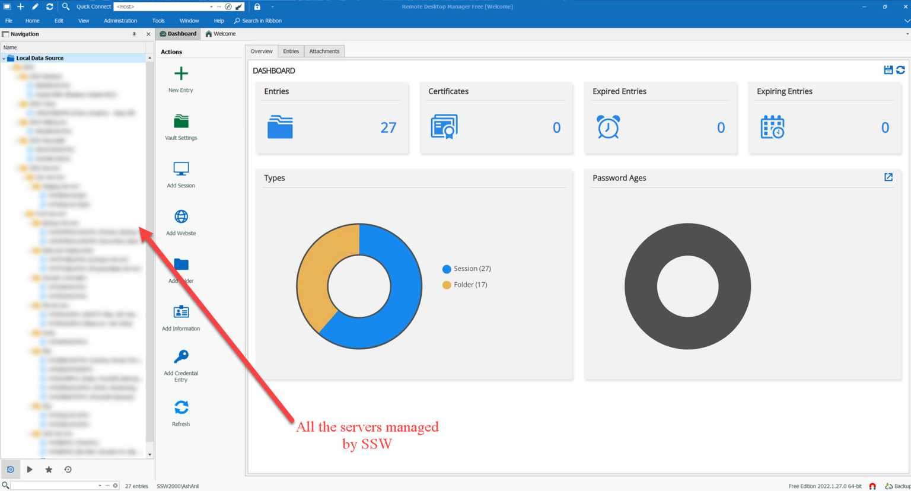

To manage multiple servers and group of domain joined computers remotely, it would be a pain for a System Administrator to use Microsoft Remote desktop connection application inbuilt in Windows https://support.microsoft.com/en-us/windows/how-to-use-remote-desktop-5fe128d5-8fb1-7a23-3b8a-41e636865e8c

### Drawbacks of Microsoft Remote Desktop Connection:

* Remote Desktop Services currently does not support multiple monitors on the terminal server.
* The GUI interface is outdated
* Remote Desktop Services should provide an option to scale up or down the screen size after a connection is established. Currently you can only adjust the screen size prior to a connection is established.
* Remote Desktop Services does not have a menu to send special key strokes like Ctrl+Alt+Del to the terminal server. 

::: bad

:::

### Solution:

Devolution is security website which offers a free Remote Connection Management called "Remote Desktop Manager", which is built to centralizes all remote connections on a single platform that is securely shared between users and across the entire team.
::: good

:::

To install the application, check https://devolutions.net/remote-desktop-manager/home/downloadfree 

### Reference:

SugarLearning item - https://my.sugarlearning.com/SSW/items/13222/ssw-remote-desktop-manager?term=RDM

Intranet - https://sswcom.sharepoint.com/:w:/r/sites/SSWSysAdmins/Shared%20Documents/General/Networking/Misc/RDMDatabase/RDM_document.docx?d=w7cc95b158d80413ba3e9fdf19ab665ed&csf=1&web=1&e=pzyLAy