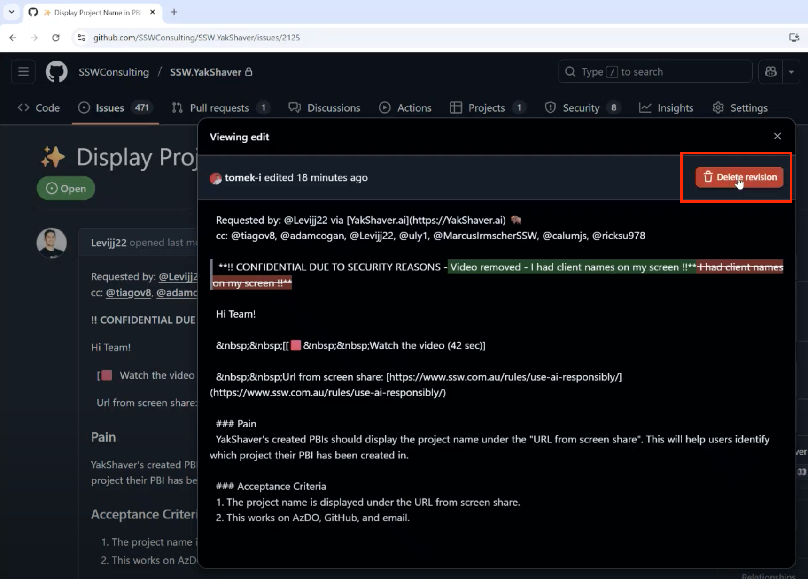
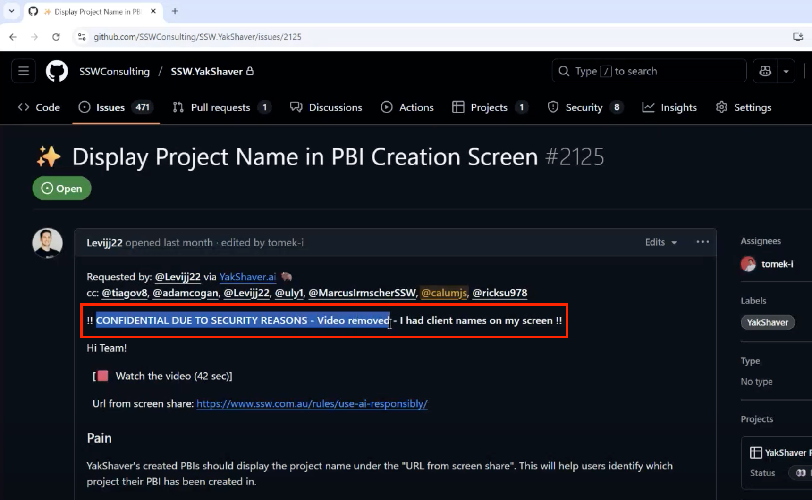

If you accidentally include confidential information in a GitHub Issue - whether it’s a password, API key, or private business details - the obvious thing to do is **edit the issue and delete the sensitive content**.

But that’s **not enough**.

GitHub retains a full revision history for issues and comments. This means others can still view older versions and recover the compromised data.

<!--endintro-->

To protect your company and users, you must **check and delete the specific revisions** that exposed the information.

Finally, it's important to leave a **transparent comment in the issue** confirming that sensitive content was removed, and where it appeared (e.g. in a video, image, or text block).

## Steps to properly remove confidential data

1. **Edit the Issue or comment**\
   Immediately remove any visible confidential data from the issue body, comment, or image attachment.

2. **Review all revisions**\
   Click the “edited” tag next to any edited comment or issue to see its history. Note which revision contains the sensitive info.
3. **Delete the affected revision**

   * If you have permission, delete the comment or attachment that contained the data.
   

   * If you **can’t delete it yourself**, **contact your repository owners or admins** and ask them to remove it.
   * If the revision still can’t be deleted (e.g. issue body history), **contact [GitHub Support](https://support.github.com/contact)** and provide:

     * The repository name
     * A direct link to the issue or comment
     * A description of the confidential information
     * A request to delete the specific revision(s)
4. **Add a note for transparency**\
   In the issue description or a comment, add a message like:\
   "**‼️ CONFIDENTIAL INFORMATION REMOVED** The affected content was in a: screenshot / comment / video / etc."  

   

## Tips to prevent future issues

* **Avoid uploading full-screen screenshots or videos** that contain internal tools, passwords, or customer data
* **Use redaction tools** before sharing media
* Always **review YakShaver recordings and generated content**
* **Enable 2FA and rotate keys** immediately if any credentials were exposed
