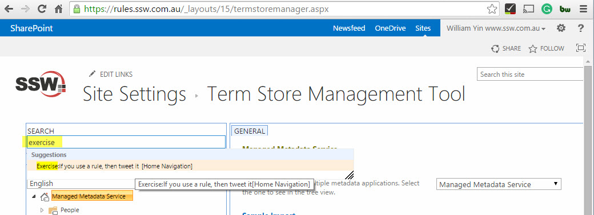
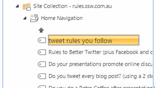
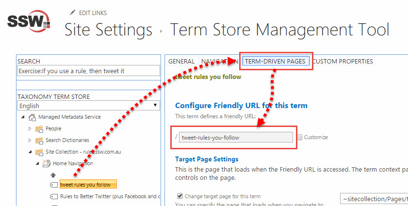
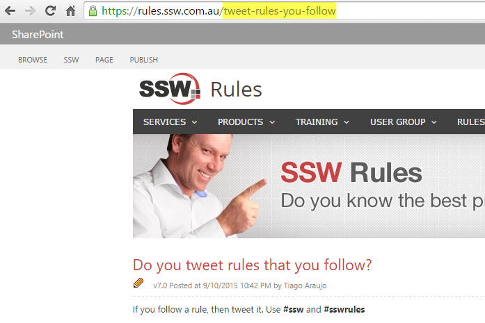
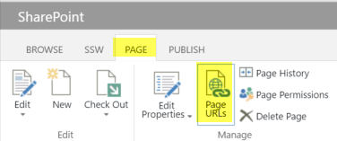
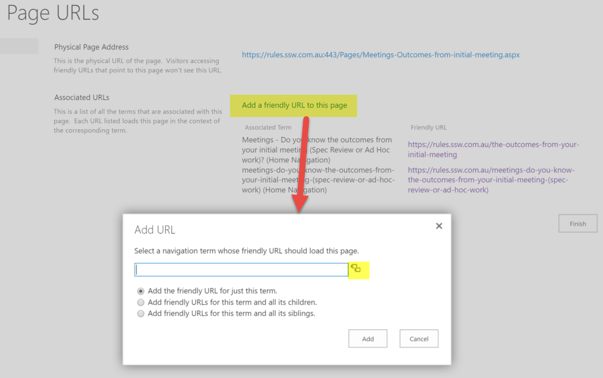
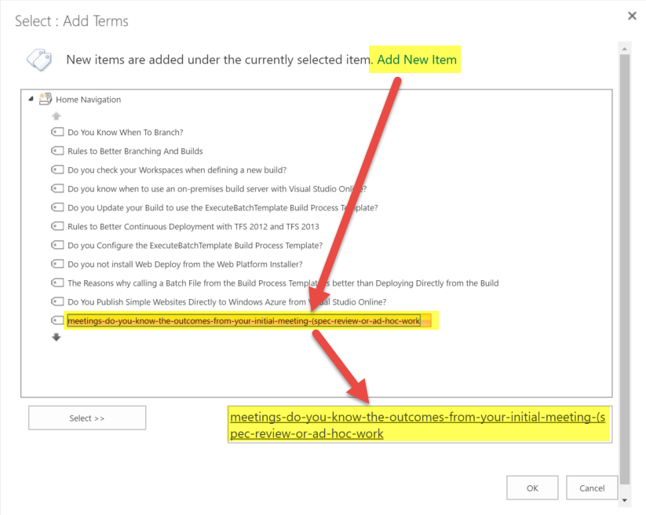
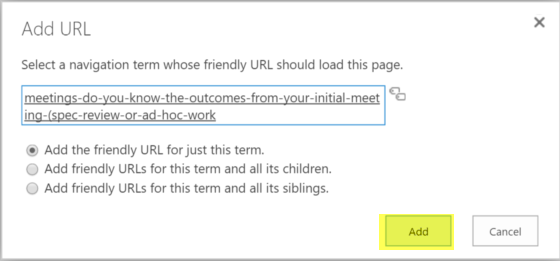
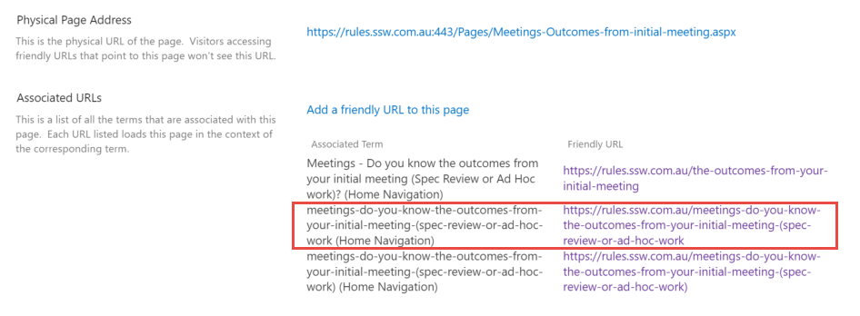

Every rule page has two URLs:

* Physical URL - e.g. `https://sharepoint.ssw.com.au/<mark>Pages/</mark>tweet-rules-you-follow<mark>.aspx</mark>`
* Friendly URL - e.g. `https://sharepoint.ssw.com.au/tweet-rules-you-follow`

Please follow the below instruction to rename one or both of them.

<!--endintro-->

### Rename Friendly URL

1. Go to "Term Store Management Tool", use "search" to find and select the old friendly URL term store item:  

2. Double click the term store item label to rename it, SharePoint will automatically convert "white space" to "-". e.g. "tweet rules you follow" will be generated with a friendly URL "tweet-rules-you-follow":

3. Click "TERM DRIVEN PAGES" to double check the generated friendly URL is correct:

4. Open browser to validate the renamed friendly URL is working well (aka not seeing 404 error):

### Redirection

The ‘auto redirect’ feature only applies to ‘physical URL’, but not to ‘friendly URL’.
When you change a 'friendly URL',  you should follow the below steps to make the old friendly URL be redirected to the new friendly URL.

1. Go to "Ribbon" | "Page URLs"

2. Click "Add  a friendly URL to this page", then click the 'tag' icon

3. In the "Select: Add Terms" dialog, click "Add New Item", input the old friendly URL, then double click it to ensure you select it

4. Click the "Add" button to add the old friendly URL, it will be redirected to the new friendly URL. (TEST: In browser, open the old friendly URL to confirm it's redirected to the new friendly URL)

5. On the "Page URLs" page, you should be able to see multiple friendly URLs associated to current page.

