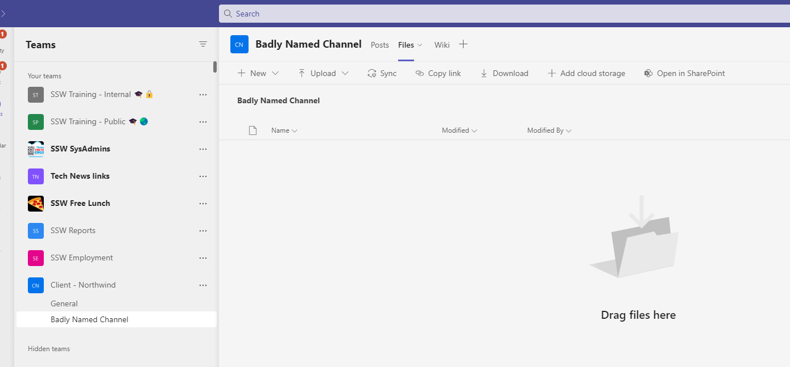
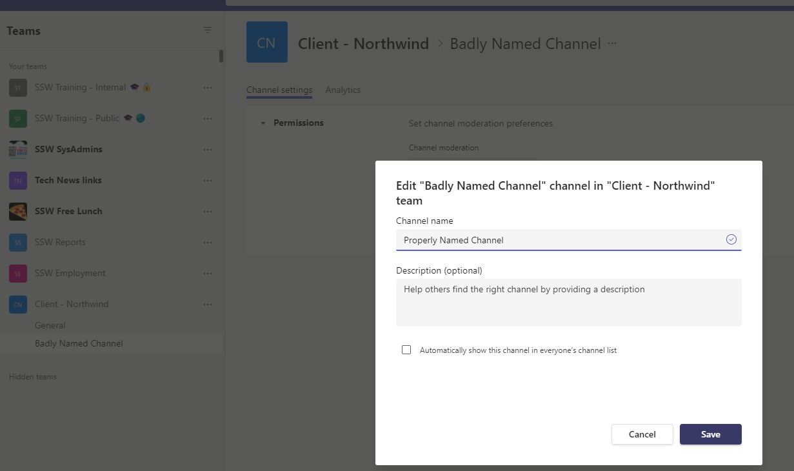
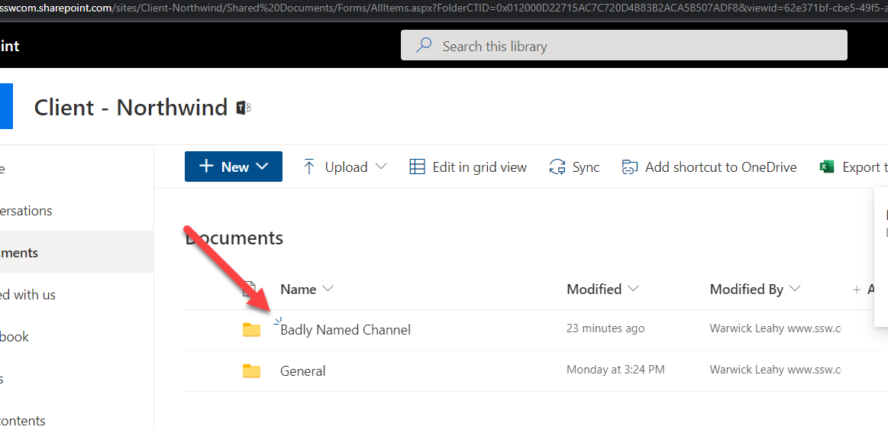

Have you ever made a spelling mistake when you named a Teams Channel? Have you then tried to rename the Channel? If so you will notice that the underlying SharePoint folder is still named incorrectly.

<!--endintro-->

To rename the folder there is a workaround to do this correctly.

1. Rename the Team Channel

   

:::bad
Note this hasn't changed the name of the folder in SharePoint

2. Delete the Channel

   
3. In SharePoint rename the folder
4. Restore the Channel