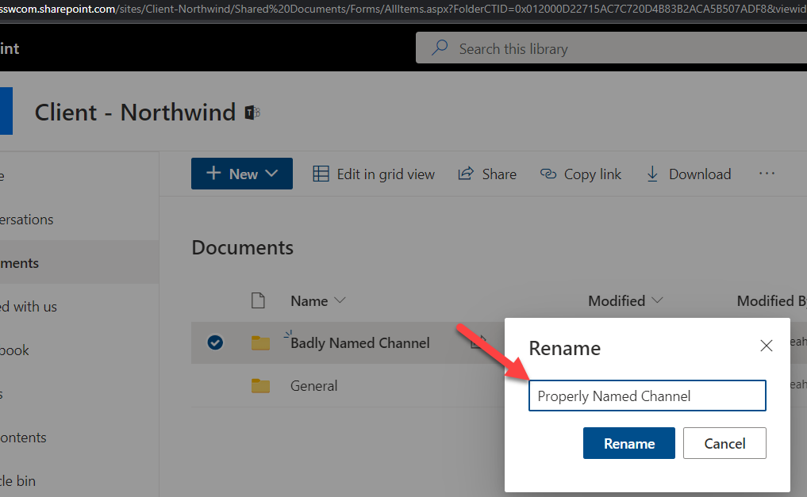

Have you ever made a spelling mistake when you named a Teams channel? Have you then tried to rename the Channel? If so you will notice that the underlying SharePoint folder is still named incorrectly.

<!--endintro-->

To rename the folder there is a workaround to do this correctly.

1. Rename the Team channel

   

:::bad
Note this hasn't changed the name of the folder in SharePoint

2. Delete the channel

   
3. Now in SharePoint we can rename the folder

   

   Make sure that you rename the folder exactly the same as the channel was named

   
4. Click the ellipses beside the Team name | Manage Team

   
5. Click Channels | Select the arrow beside deleted | Choose restore beside the channel that you wish to restore

   