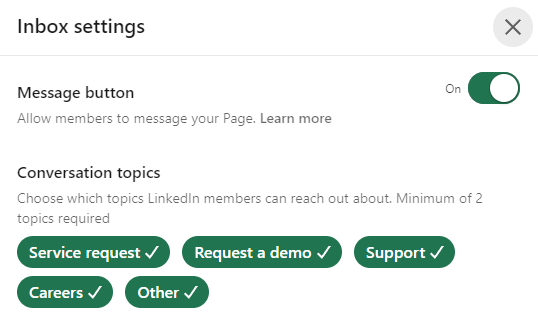

Responding to messages from the general public and clients on social media is an integral part of maintaining a company's online presence and reputation. Platforms like LinkedIn, Meta (Facebook, Instagram, WhatsApp), X (formely Twitter) and others provide different avenues for these interactions.

Focusing primarily on LinkedIn, this rule outlines how to effectively manage and respond to messages ensuring that the conversation aligns with the utility and purpose of the feature.

<!--endintro-->

### LinkedIn Company Pages

When messaging for your Page is enabled on LinkedIn, members can directly communicate with your company. This feature is a powerful tool for engaging with a professional audience, allowing for direct interaction and networking. And the best part? You can select conversation topics 😃

The reply feature plays a pivotal role in managing LinkedIn communication and interactions if your businesses frequently receive inquiries from clients, potential employees, and partners.

#### How to Enable Messages for LinkedIn

To enable messages for your Page:

1. Go to your Page super or content admin view.

2. Click Inbox in the left menu.

3. Click the three dots (more icon) to the right of Inbox.

4. Select Inbox settings from the dropdown menu.

5. Turn on the Message button toggle on the right and select relevant conversation topics.

      

7. Click Save in the upper-right corner.

#### Key Aspects of the Reply Feature

Here are some keys reasons why you should consider implementing the LinkedIn reply feature.

Pre-set Responses: Setting up pre-written responses to common inquiries relating to conversation topics such as requesting a demo, careers, service request and gneralt support.

Common Questions: For frequently asked questions based on the above conversation topics, automated replies provide instant information, improving the user experience and reducing the inital workload on your team.

Conversation Topics: On platforms like LinkedIn, automated replies can be aligned with selected conversation topics, ensuring relevance in responses.

Time-Saving: It significantly reduces the time spent on repetitive queries, allowing your team to focus on more complex inquiries that require personalized attention.

Customer Experience: Immediate responses to inquiries, even if automated, enhance the customer experience, as users receive prompt acknowledgments and information.

#### Best Practices for LinkedIn Messaging

* **Assign the Right Admin Roles**: Ensure that individuals with the 'super' or 'content admin' role are equipped to reply to messages. This is particularly important for specific conversation topics, like "Careers," where subject matter experts should manage interactions.
* **Prompt Responses**: Aim to reply to messages as quickly as possible to maintain engagement and show that your company values the interaction.
* **Setting Up Conversation Topics**: When enabling messaging, select conversation topics that reflect the subjects you want members to inquire about. This helps in guiding the conversation and ensuring relevance.
* **Edit Conversation Topics for Accuracy**: Modify the topic of a message to accurately reflect its content. This aids in organizing and filtering conversations in your inbox.
* **Option to Disable Messaging**: If necessary, you can disable the messaging feature from your inbox settings. This removes the "Message" button from your Page and stops new messages from members.

::: greybox
Ensure that your LinkedIn Page messaging reflects your company's voice and expertise, and that it's managed by knowledgeable team members.
:::

### Meta: Limited Engagement

Meta's tools are particularly effective for businesses targeting a demographic that is highly engaged on social media, especially for consumer-focused interactions.

However, for B2B communications or audiences less active on social platforms, the utility of Meta's messaging features is limited.

### X: An Alternative Approach

X offers messaging features that might provide alternative advantages for certain business communications. It's crucial to evaluate how user demographics align with your company's goals and target audience.

If your business caters to a more professional or niche market, X is a great tool for targeted B2B communications or reaching specific customer segments.
