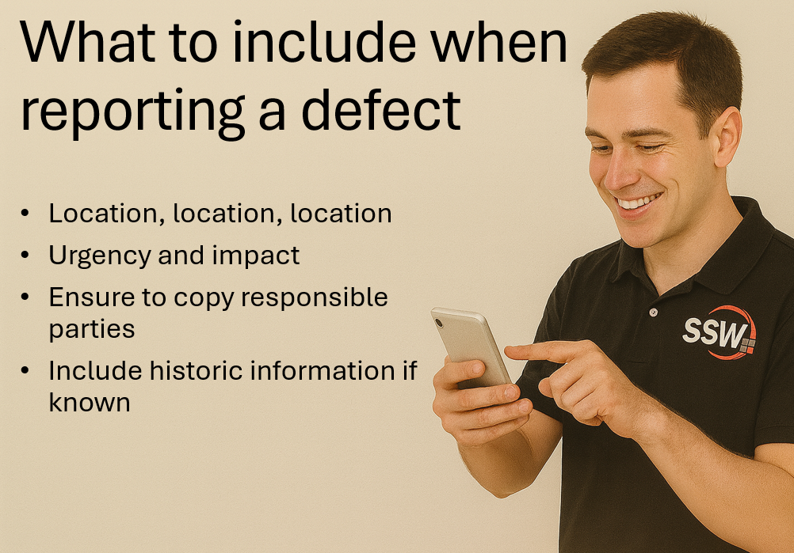
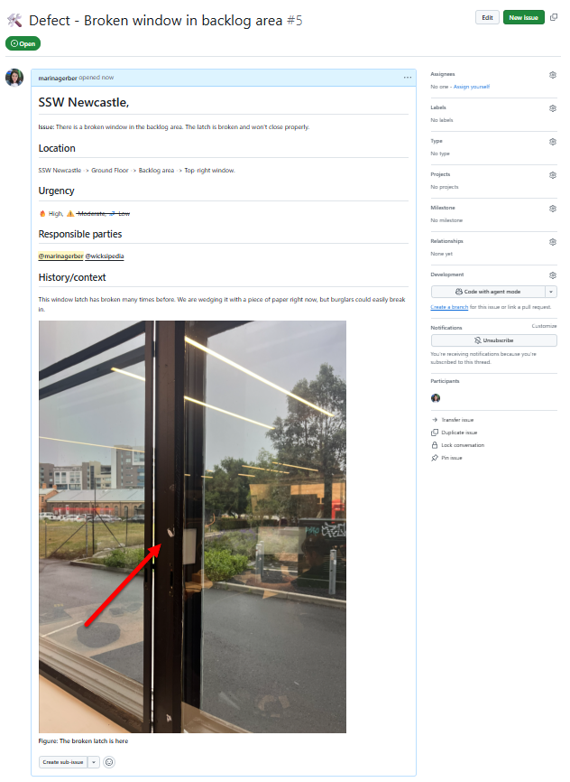

When a defect occurs in an office (e.g. a broken window, faulty air conditioning, or leaking tap), it’s crucial to report it with enough detail so that the Property Manager can take quick and accurate action.  Many issues get delayed or mishandled because the initial report is missing key details like **location**, **urgency**, or **who has been informed**.

::: info
**Tip:** Make sure to follow the rule: Office environment - [Do you label broken equipment?](https://www.ssw.com.au/rules/label-broken-equipment/)
:::

<!--endintro-->

Good reporting not only helps the Property Manager resolve issues faster, it also improves **turnaround time (TAT)**, **feedback**, and **follow-up communication**.  

When reporting a defect, always make sure your message is **clear**, **complete**, and **actionable**.  

## Create a PBI (YakShave it)

* For traceability, **create a PBI (Product Backlog Item)** in your maintenance backlog titled “Defect – \[Brief Description]”  
* Link the PBI in your message so others can track progress and updates\
  **Example:** “Created PBI: [Defect – Broken window in backlog area](#)”

### Key details to be included

#### 1. Location

Start broad and zoom in:  

* Office name → floor → area → exact item\
  **Example:** “SSW Newcastle → Ground floor → Backlog area → Top right window”

#### 2. Urgency and impact

Does the defect affect your **productivity** or **safety**?  If yes:

* Clearly state the impact\
  **Example:** “Can’t use meeting room due to flickering lights”
     
* Mention any temporary fix you’ve applied\
  **Example:** “Taped over the exposed wire until repaired”

#### 3. Ensure you inform responsible parties

Inform the people who is aware of the problem. Always include:  

* The **Head of Office**  
* The **Property Manager**  

::: info
**Tip:** Use @mentions int the PBI, or if you’re reporting via Teams or email, e.g. “@John Smith @Sarah Jones”.
:::

#### 4. Historic information

* Note any past occurrences or related maintenance\
  **Example:** “Window was repaired in 2022 for the same issue”

- - -

## Examples

::: greybox
“The window in Newcastle is broken. Someone should get it fixed.”
:::
::: bad
Figure: Bad example – Too vague; missing location, urgency, and who it’s reported to
:::

::: good

:::

Consistency in reporting helps ensure that all offices communicate defects in the same clear way — improving turnaround time, transparency, and accountability.

“[YakShaving](https://yakshaver.ai/)” each defect into a **PBI** will ensure property issues are logged, tracked, and resolved efficiently — saving time, reducing confusion, and improving everyone’s work environment.
