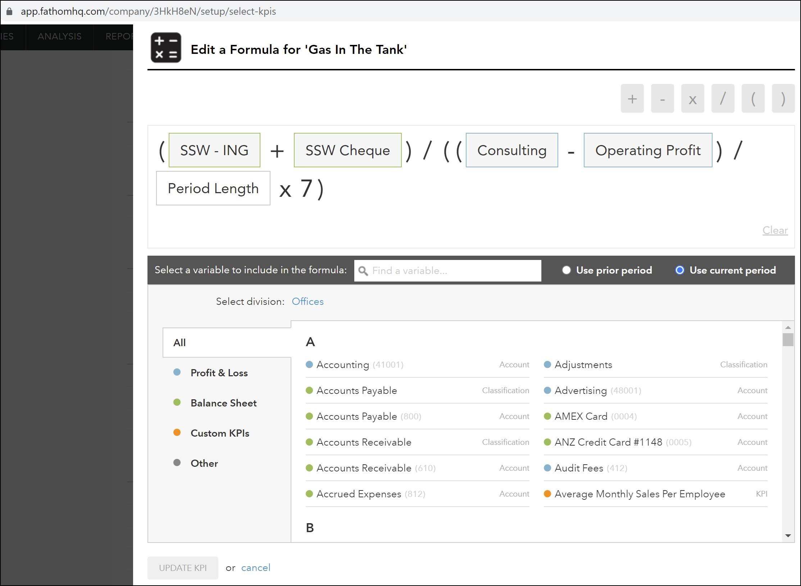

We all know the situation but never think it will happen to us. Many businesses believe they are well prepared in the event of a disaster or a downturn in business activity.

In the unfortunate event that all your customers suddenly stop trading (meaning your income levels are reduced to zero), do you know how long you can keep the business afloat based on your cash balance, without taking any cost-cutting measures?

It is recommended to keep track of your "Gas in the Tank" report at least every month to determine the number of weeks your business will remain afloat in the unlikely event of the above scenario.

<!--endintro-->

For most businesses, a good amount of cash to hold should cover approximately **26 weeks of costs** .

::: bad

:::

The length of time which the business can survive on cash reserves is not as high as ideal. 13 weeks is not a lot of time to respond to a significant downturn of activity, assuming it was identified at the first-week activity went down. This report would have revealed the calculations and henceforth increase the business awareness and to keep the foot on the pedal.

::: good

:::

This example is a good indication the business has enough cash reserves, that even with a significant downturn in activities, there will be enough time to respond and likely reverse the situation. They achieve this by either maintaining cost measures low or consistently driving for new customers and a minimum level of business activity, as well as other business-specific strategies.

Often a business can become satisfied with a few good months of positive cash flow whether it be a result of cost-cutting efforts or improved business activities for those months.

As a result, some businesses become complacent and not realise their actual ability to stay afloat based on their cash reserves if disaster strikes.

Maintaining a Gas in the Tank report will provide a visual indication and a prompt to revisit costs and additional measures in driving business activities, before it becomes a problem.

::: info

**Tip:** Use Fathom - an extension for XERO Accounting.

You can make this report very easily with Fathom Reporting. Here is an example:

:::
