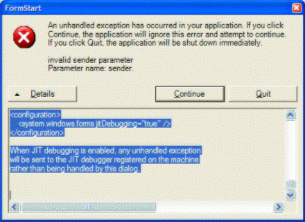

.NET applications can sometimes produce a stack trace of an error, these error messages are all we need to figure out what has happened. **Please do not send us this screenshot**, instead, select the top section of what's within this box and paste it in an email that you can send back to us.

<!--endintro-->

The text within the 'Details' button is more useful for debugging and locating the problem.

::: greybox
See the end of this message for details on invoking
just-in-time (JIT) debugging instead of this dialog box.

We really want this part:
\*\*\*\*\*\*\*\*\*\*\*\*\*\* Exception Text \*\*\*\*\*\*\*\*\*\*\*\*\*\*
System.ArgumentException: invalid sender parameter
Parameter name: sender
at WindowsApplication3.FormStart.button5_Click(Object sender, EventArgs e) in c:\datajohnliu\datavs7projects\windowsapplication3\formstart.cs:line 143
at System.Windows.Forms.Control.OnClick(EventArgs e)
at System.Windows.Forms.Button.OnClick(EventArgs e)
at System.Windows.Forms.Button.OnMouseUp(MouseEventArgs mevent)
at System.Windows.Forms.Control.WmMouseUp(Message& m, MouseButtons button, Int32 clicks)
at System.Windows.Forms.Control.WndProc(Message& m)
at System.Windows.Forms.ButtonBase.WndProc(Message& m)
at System.Windows.Forms.Button.WndProc(Message& m)
at System.Windows.Forms.ControlNativeWindow.OnMessage(Message& m)
at System.Windows.Forms.ControlNativeWindow.WndProc(Message& m)
at System.Windows.Forms.NativeWindow.Callback(IntPtr hWnd, Int32 msg, IntPtr wparam, IntPtr lparam)

This part is quite useful sometimes too.
\*\*\*\*\*\*\*\*\*\*\*\*\*\* Loaded Assemblies \*\*\*\*\*\*\*\*\*\*\*\*\*\*
mscorlib
Assembly Version: 1.0.3300.0
Win32 Version: 1.0.3705.288
CodeBase: file:///c:/windows/microsoft.net/framework/ v1.0.3705/mscorlib.dll

- - -

WindowsApplication3
Assembly Version: 1.0.1129.31301
Win32 Version: 1.0.1129.31301
CodeBase: file:///C:/DataJohnLiu/DataVS7Projects/ WindowsApplication3/bin/Debug/WindowsApplication3.exe

- - -

System.Windows.Forms
Assembly Version: 1.0.3300.0
Win32 Version: 1.0.3705.288
CodeBase: file:///c:/windows/assembly/gac/system.windows.forms/ 1.0.3300.0__b77a5c561934e089/system.windows.forms.dll

- - -

System
Assembly Version: 1.0.3300.0
Win32 Version: 1.0.3705.288
CodeBase: file:///c:/windows/assembly/gac/system/ 1.0.3300.0__b77a5c561934e089/system.dll

- - -

System.Drawing
Assembly Version: 1.0.3300.0
Win32 Version: 1.0.3705.288
CodeBase: file:///c:/windows/assembly/gac/system.drawing/ 1.0.3300.0__b03f5f7f11d50a3a/system.drawing.dll

- - -

System.Xml
Assembly Version: 1.0.3300.0
Win32 Version: 1.0.3705.288
CodeBase: file:///c:/windows/assembly/gac/system.xml/ 1.0.3300.0__b77a5c561934e089/system.xml.dll

- - -

These are not really useful
\*\*\*\*\*\*\*\*\*\*\*\*\*\* JIT Debugging \*\*\*\*\*\*\*\*\*\*\*\*\*\*
To enable just in time (JIT) debugging, the config file for this
application or machine (machine.config) must have the
jitDebugging value set in the system.windows.forms section.
The application must also be compiled with debugging
enabled.

For example:

&lt;configuration&gt;
&lt;system.windows.forms jitDebugging="true" /&gt;
&lt;/configuration&gt;

When JIT debugging is enabled, any unhandled exception
will be sent to the JIT debugger registered on the machine
rather than being handled by this dialog.\
:::

**Figure: This information is way more useful**
