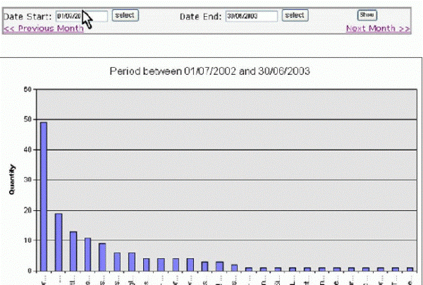

<ol><li>Have Selection for filters e.g. Date Ranges </li><li>Have Selection for chart options e.g. Show Legend </li><li>Don't have selection for chart groupings e.g. By Month or By Product
                        <ul><li>Crystal and Access these are built into the report and it is very complex to 
                                have a generic solution. </li><li>Also it is disorientating for the user to have this as a selection</li></ul></li></ol>
 <excerpt class='endintro'></excerpt> 
<dl class="image"><dt> 
      
   </dt></dl>
 More 
   <a href="http://www.ssw.com.au/ssw/Standards/DeveloperDotNet/GuidelinesForReporting.aspx">Options for Reporting</a>

