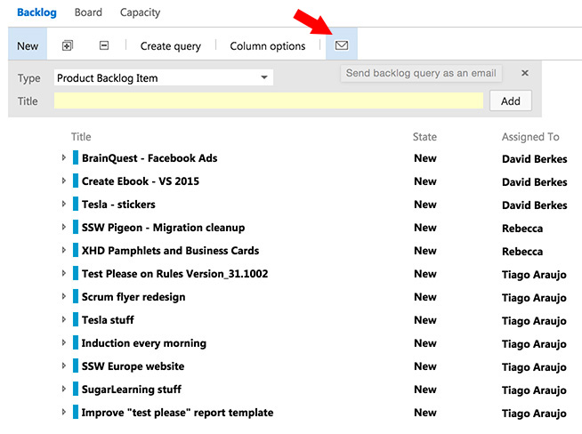
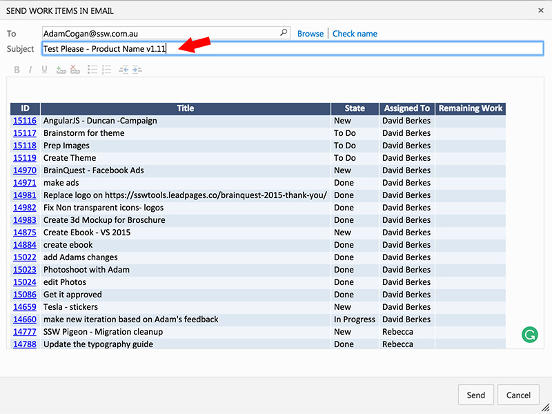

These are the steps you should take when request a "test please" :

<!--endintro-->

1. Find two free testers to send the email below
2. Stop working on the project until you receive either a "pass" or "fail" email
3. Create your "test please" following this template: (refer to Windows Forms or Email templates below)

**Subject: Test Please - Product Name v1.11**

Dear [XXX],

I am looking for bugs or approval to release this version.

I have done what I could for my code's health. E.g.

    * Run SSW Code Auditor - it has [XXX] errors [If not 0, give reason]
    * Run SSW Link Auditor - it has [XXX] errors [If not 0, give reason]
    * Kept my eye on Application Insights

Specific issues to look out for are:

    * [XXX]
    * [YYY]

The latest version of [XXX] is at [WWW.URL.COM]

Keep in mind that a "test please" is an urgent task and that it should start within the hour.

**Note:**

    * Send suggestions/bugs one email at a time (with a new email subject) because it makes it easier to fix and reply "done"
        * Please CC the project manager [xxx@yyy.com] and the client [xxx@yyy.com]
    * Know the definition of a bug. Read http://www.ssw.com.au/ssw/Standards/Support/BugReportOrEnhancement.aspx
    * Understand the importance of testing. Read the rule on [Do you conduct a "test please" internally and then with the client?](/conduct-a-test-please-internally-and-then-with-the-client)
    * Use good subjects on your emails. Read [Do you realize the importance of a good email Subject?](/do-you-realize-the-importance-of-a-good-email-subject)
    * Do not reply to this message until you can say "Test Please Succeeded (as no Critical bugs). You are ready to deploy." or "Test Please Failed (as per Critical bugs reported)"

Thanks, [XXX]
4. **What if you're doing a Windows Forms test?**     Then you should also include this to the email:
    * The latest version of [XXX] has been uploaded to \\frog\SSW\Download\[Application\_verX-XX\_beta.exe
    * Test on a fresh VPC image of Windows
    * Install into a non-default directory
    * Check the installation folder for misplaced items
    * Test Unit Tests via "Help - Run Unit Tests"
    * (If Applicable)Test the "Create" and "Reconcile" buttons. Read [Rules to Better .NET Projects](/rules-to-better-net-projects)
    * Test open and closing forms and saving values
    * Test most buttons and menus and links
    * Disable your network connection and test again (check for unhandled errors)
    * If your test fails, please rename the executable to [Application\_verX-XX\_failed.exe]
5. **What if you are doing an email test?**
    * DO NOT add Test Please to the subject. (it is too easy to forget later!)
    * Instead, add "Test please" with a yellow highlight to the top of the email body.

::: greybox
    **Subject: Product Name v1.11**
    Test please

    Dear [XXX],
    I am looking for bugs or approval to release this version.
    I have done what I could for my code's health. E.g.

:::
6. **Note to** **developer:**If current version is better than the last version you can release (even with a test fail) as long:
    * The bugs reported in the test fail existed in the old version
    * Two people have tested it
    * The changes in this version are fairly important to get out
    * You get to work on the failures ASAP
7. For clients on fixed price contracts, this email marks the start of the 30 day warranty period.
8. Use TFS to email the work items to the project manager and client: 
  

