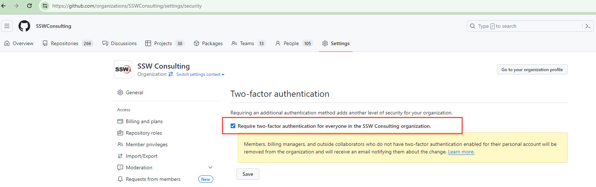

If all members use 2FA in your organisation, the risk of unauthorised access to your repositories is lower. GitHub organisations can be configured to require all members to use 2FA to join.

<!--endintro-->

1. Go to your organisation | Settings | Organization security
2. Under 'Two-factor authentication', select 'Require two-factor authentication for everyone in your organization'
3. Save

::: info
Enforcing 2FA in an existing organisation will remove members that are not using 2FA.
:::

See the GitHub docs [Requiring two-factor authentication in your organization](https://docs.github.com/en/organizations/keeping-your-organization-secure/requiring-two-factor-authentication-in-your-organization)
