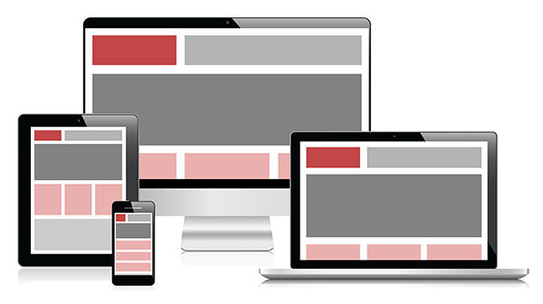

You may be nicely equipped with a 4k monitor at work, but many people will access your content via their mobile phone or tablet.

Your website should work nicely on any screens that vary from a mobile/tablet to a large PC monitor.

<!--endintro-->

::: good  
  
:::

Google has a web tool to [test how mobile-friendly your site is.](https://testmysite.thinkwithgoogle.com/)

Know more at [Responsive Web Design: What It Is and How To Use It](http://www.smashingmagazine.com/2011/01/12/guidelines-for-responsive-web-design/).

### Go beyond responsive design

Responsive Web Design is great. It lets you alter the display of a web page using CSS to better suit screens of different sizes.

When building websites targeting mobile devices it is only part of the solution, however.

`youtube: https://www.youtube.com/embed/IUE6Ut0GXi4?rel=0`

**Figure: Watch the [clip with Dino Esposito](http://tv.ssw.com/4681/writing-mobile-sites-lessons-learned-top-tips-web-developers) to find out why**
