So you have just finished that sweet video edit and you are now ready & excited to receive feedback from your team and or client. You just sent the link to the video to get "Test Pleased" and now the struggle begins with issues like:

* Feedback and video are in 2 different places - So you have to jump back and forth between feedback notes and video
* No single source of feedback - Feedback is given by word of mouth, multiple email threads, comments and handwritten notes
* Overlapping or conflicting feedback from different people
* Version control - Versions not linked automatically
* Timecodes - You need to manually document timecodes
* Video accessibility - During a teams call only one person can interact with the video
* Feedback clarity -  No ability to draw on the video
* Project handover - Difficulty sharing with other editors E.G. No single source of truth

This is where collaborative viewing platforms like [Frame.io](https://frame.io) come in. 

`youtube: https://www.youtube.com/embed/rapbhpW3jPM`
**Video: What is Frame.io? (2 min)**

Frame.io is a purpose-built video review and collaboration software that lets you share, comment, and approve videos with your team and clients. Frame.io integrates with popular editing tools such as Adobe Premiere Pro and After Effects, so you can work seamlessly across different platforms.

## Getting started

To review and comment on video projects in Frame.io you don't need an account, it will simply prompt you to put in your name and email address.

To upload and manage your projects in Frame.io, you need to create an account. If you have an Adobe CC Subscription, you can log in using that account.

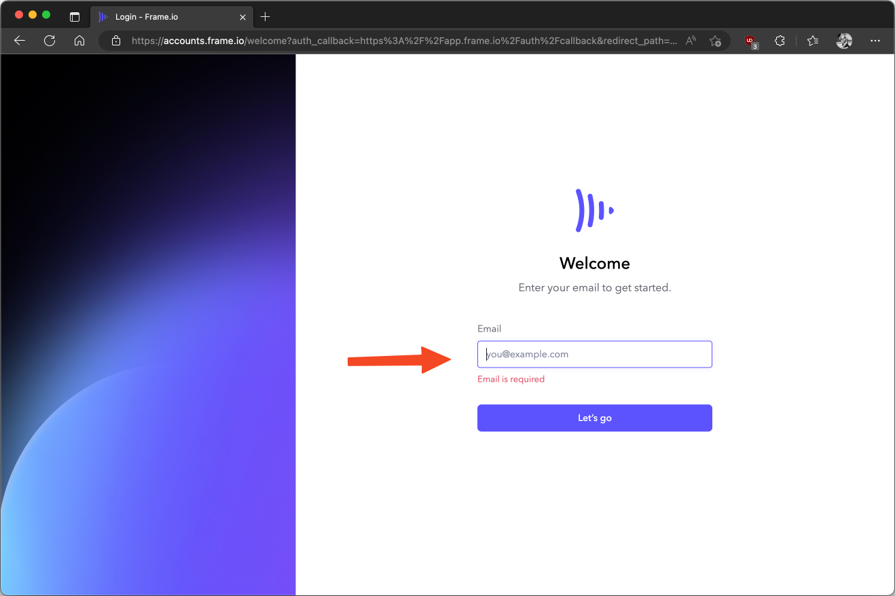

Once you have logged in, you can create projects and invite collaborators. You can upload videos from your computer by dragging and dropping them onto the projects page or cloud storage, or import them directly from your editing software using the Frame.io extension. You can also organize your videos into folders and subfolders for easy access.

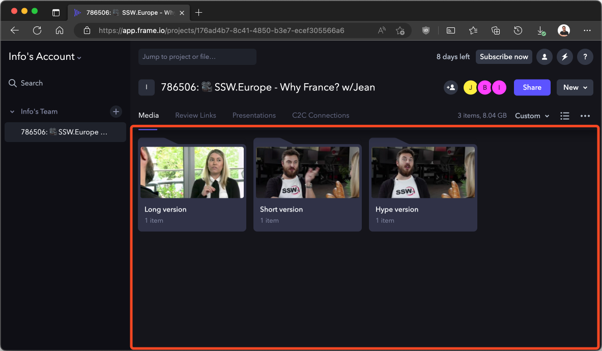

## Sharing video for feedback

To share a video for review, you can generate a shareable link that anyone can access without logging in. You can customize the link settings such as password protection, expiration date, download permission, watermarking, etc. To do this; 

1. Click and highlight the video you wish to share
2. Click the 3 dots on the lower right-hand side of the selected thumbnail

  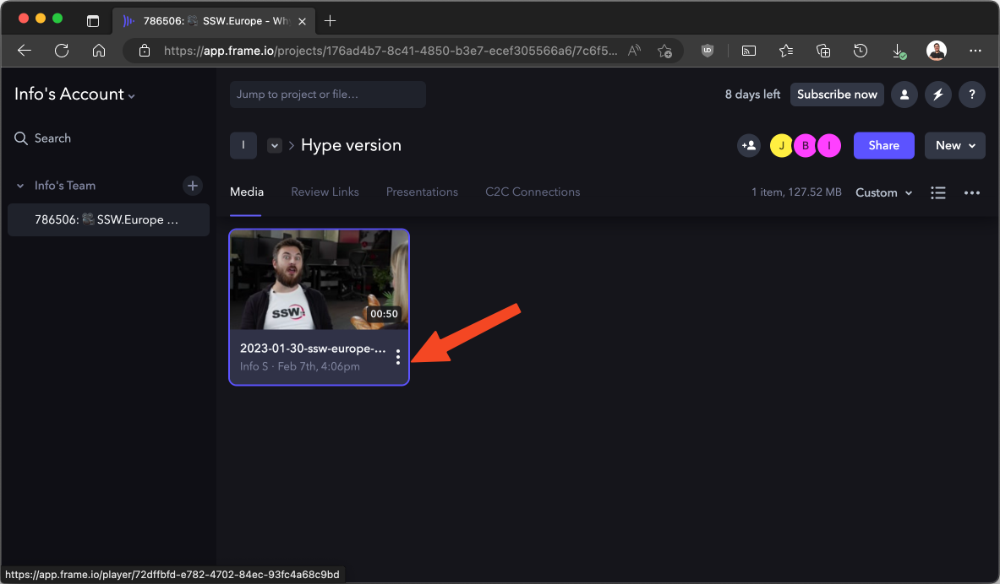

3. Navigate to **Share | Share for Review**

  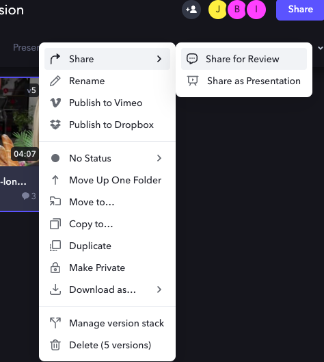

4. Share link - copy the link and send to the reviewer, or add them using the email field

  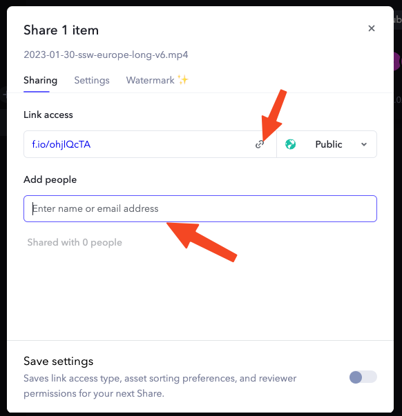

## Reviewing videos

To review a video, you can play it back through a browser on any device and leave feedback, pinpointed down to the second! You can use annotations, emojis, drawings, etc. to make your comments more specific and actionable. You can also reply to other comments or tag collaborators to notify them.

1. To make a comment, pause the video where you wish to give feedback, then in the comment field located below the video player type your feedback

  **Note:** If you cancel your feedback, your feedback will be cleared.

  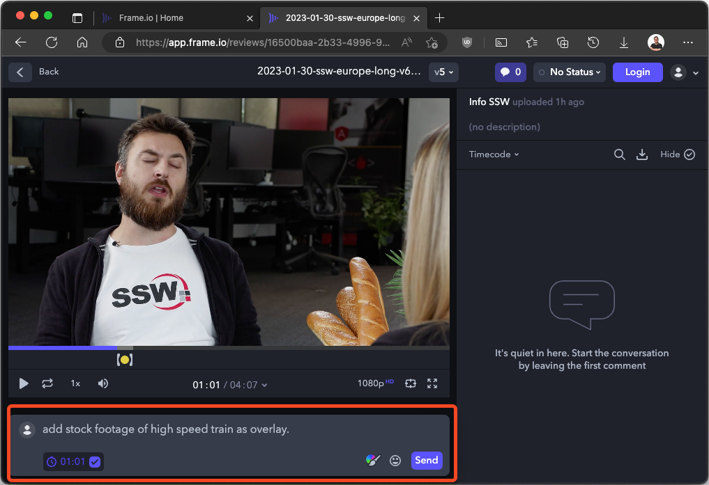

2. If you haven’t logged in yet, you will be prompted to enter your Name and Email 

  **Note:** If you cancel this prompt, your feedback will be cleared.

  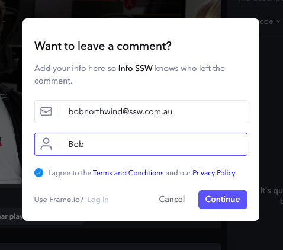

3. In/Out points - To make a comment that covers a specific section, click and drag the ‘\[‘ left or ‘]’ right to set your ‘in’ and ‘out’ points

  **Notes:** 

  * To clear the playback range of the video press the escape key on the keyboard.
  * Playback of a section will loop in the playback range.

  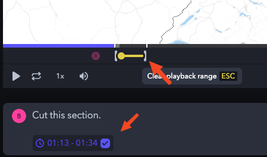

4. Drawing on a video - to enhance your comment, try selecting the paintbrush tool located next to the send button, then use your mouse to draw on the video

  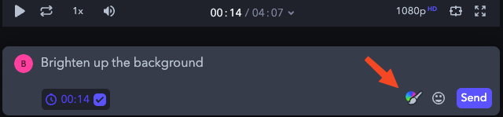

  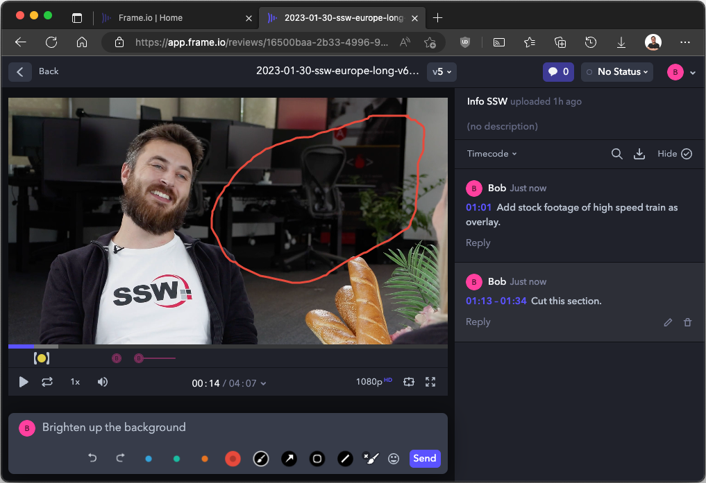

5. Edit your comment - on the sidebar, select the pencil icon to make edits to your previous comment

  **Note:** Any unsaved changes will revert to the original comment.

  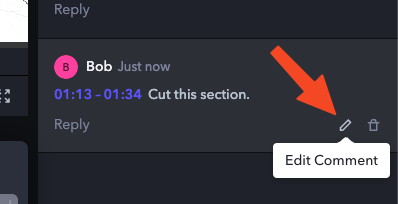

6. Video versions - all previous and current versions are bundled under the same link. To check your version, or swap to a different version, select the version dropdown at top of the page

  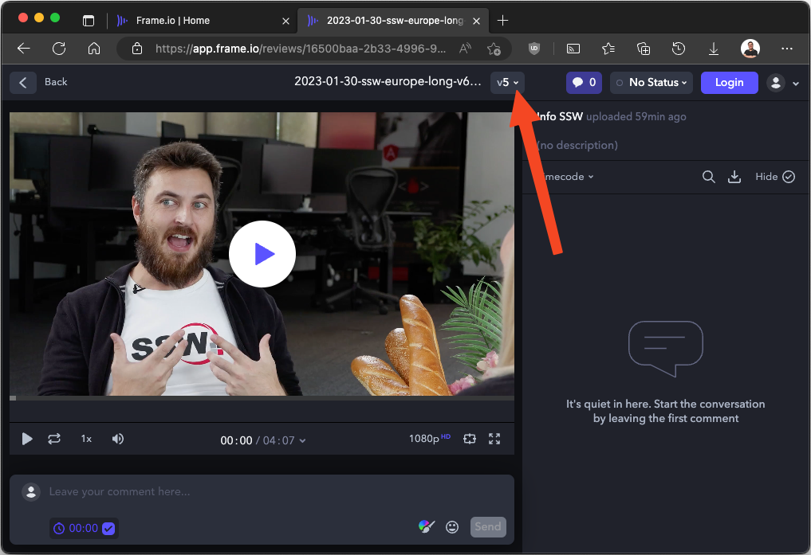

  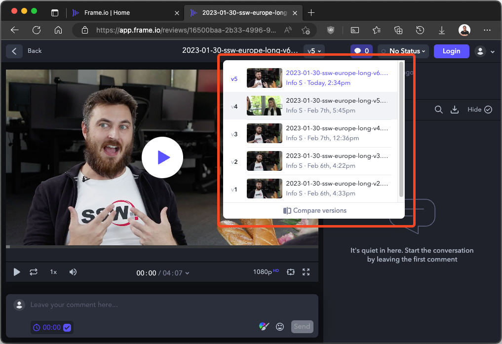

## Actioning feedback

Exporting feedback - to download all comments:

1. Navigate to the comment sidebar and click on the download button

  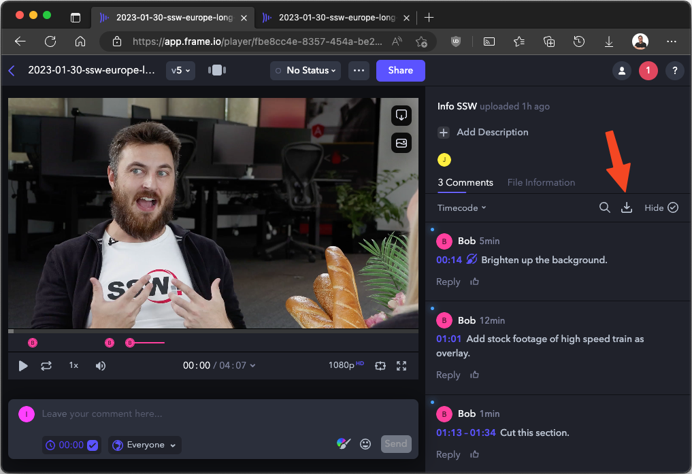

2. Navigate to 'download as file' and export comments as CSVs (for reference or imported markers to your choice of editing software)

  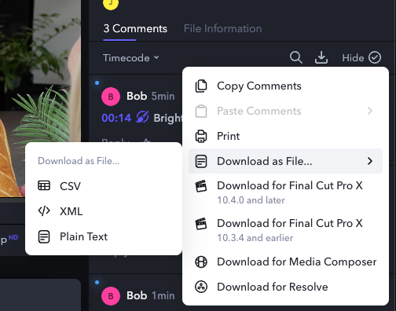

3. Completing feedback - to mark a comment as done, click the circle on the top right of the highlighted comment to mark as complete

  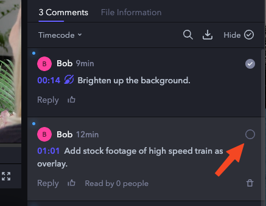

## Why you shouldn't review videos on delivery platforms

The top video social media are:

* YouTube
* YouTube Shorts
* Vimeo
* Instagram
* TikTok

Comparison table using delivery platforms over Frame.io for reviewing

|                                     | Frame.io | One Drive | Vimeo | YouTube | YouTube Shorts | Instagram | TikTok |
|------------------------------------ | -------- | :-------: | :---: | :-----: | :-------------:| :-------: | -----: |
| Playback Controls                   | ✅       | ✅       | ✅    | ✅      | ❌             | ❌       | ❌ |
| Basic Timecode                      | ✅       | ✅       | ✅    | ✅      | ❌             | ❌       | ❌ |
| Advance Timecode with Frame Counter | ✅       | ❌       | ❌    | ❌      | ❌             | ❌       | ❌ |
| Unlisted Videos                     | ✅       | ✅       | ✅    | ✅      | ✅             | ❌       | ❌ |
| Versioning                          | ✅       | ✅       | ✅    | ❌      | ❌             | ❌       | ❌ |
| Timestamped comments                | ✅       | ❌       | ✅    | ✅      | ❌             | ❌       | ❌ |
| Project File Management             | ✅       | ✅       | ❌    | ❌      | ❌             | ❌       | ❌ |
| Downloadable                        | ✅       | ✅       | ✅    | Low Quality  | Low Quality  | ❌     | ❌ |
| Draw on Video                       | ✅       | ❌       | ❌    | ❌      | ❌             | ❌       | ❌ |
| Export Comments                     | ✅       | ❌       | ❌    | ❌      | ❌             | ❌         | ❌ |
| Available in China                     | ✅       | ❌       | ❌    | ❌      | ❌             | ❌         | ❌ |

Frame.io is a powerful tool that simplifies video collaboration and feedback. It helps you reduce review cycles and speed up approvals while maintaining high-quality standards. Whether you are working solo or with a team of editors/producers/directors/client/etc., Frame.io will help you deliver amazing videos faster and easier.
