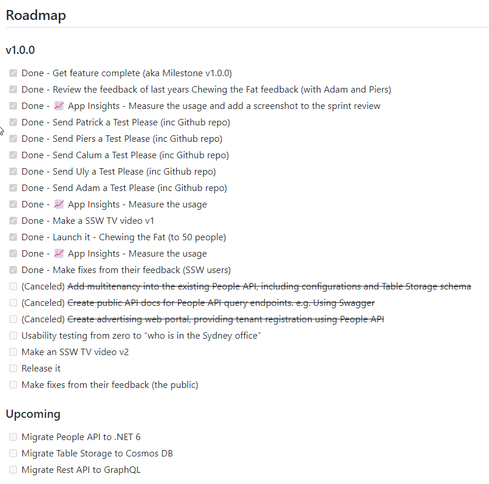
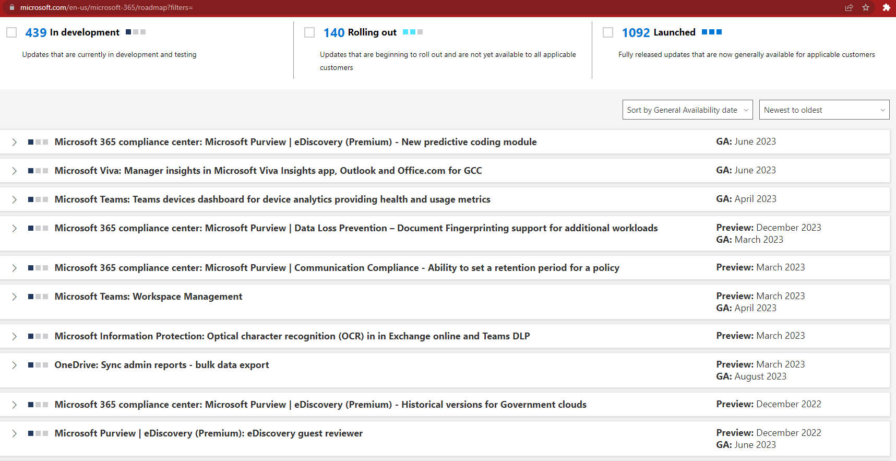
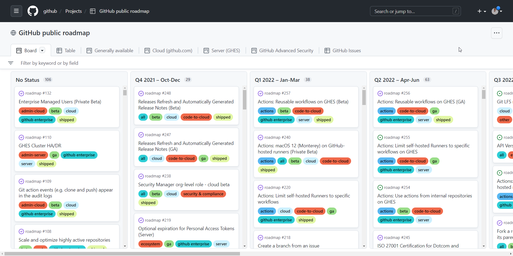

A product backlog is a great way to see the fairly small broken up PBIs (Product Backlog Items) that make up your team's "to do" list, but it can be a bit too zoomed in and makes it easy to stray from the product goals.

To get a better zoomed out view, you should have a product roadmap. 

<!--endintro-->

`youtube: https://www.youtube.com/embed/FXMMZvE1lig`

A product roadmap is an overview of the tasks that you need to reach specific milestones.

Having this zoomed out view helps the team to stay focused on the overall goal of the project and the long term priorities. It also prevents the team from getting side-tracked on issues that are not really what the business wants.

### Ways to track a roadmap

There are heaps of tools out there you can use to make a product roadmap including:

* [GitHub Projects and GitHub Issues](https://docs.github.com/en/issues/planning-and-tracking-with-projects/creating-projects/creating-a-project)
* [GitHub Milestones](https://docs.github.com/en/issues/using-labels-and-milestones-to-track-work/about-milestones)
* [Azure DevOps - Team delivery plans in Azure Boards](https://docs.microsoft.com/en-us/azure/devops/boards/plans/review-team-plans?view=azure-devops)
* [Azure DevOps - Feature Timeline](https://docs.microsoft.com/en-us/azure/devops/boards/extensions/feature-timeline?view=azure-devops)
* [Azure DevOps - Using the Epic roadmap to provide a calendar view](https://docs.microsoft.com/en-us/azure/devops/boards/extensions/epic-roadmap?view=azure-devops)
* [Aha!](https://www.aha.io/roadmapping/guide/product-roadmap/roadmap-examples)
* Storing it in the project wiki

These tools track items using different terminology such as Features, Epics or MMFs (Minimum Marketable Features), but whatever approach you take, the concept is essentially the same.

Simply add a list of important milestones. Then tick them off as you go. 

Ideally, you want to make some progress on product roadmap items in every Sprint, so make sure to review your product roadmap during your regular Sprint Reviews.

### Building the product roadmap

It's important to think about the scope of the product when building the product roadmap so that the milestones are an achievable grouping of tasks. Consider the size of your team: 

* For small teams that shift to different products a lot, you might want to make the milestones a bit more granular and short term. 
* For larger product oriented teams, it is more important to have a general overview of what is going to happen across a longer timeframe.

By factoring in the size of the team, it keeps everyone accountable while remaining realistic.

::: good

:::

See: [SophieBot product roadmap](https://github.com/SSWConsulting/SSW.SophieBot/wiki#roadmap)

::: good

:::

See: [Microsoft365 product roadmap](https://www.microsoft.com/en-us/microsoft-365/roadmap)

::: good

:::

See: [GitHub product roadmap](https://github.com/orgs/github/projects/4247/views/1)