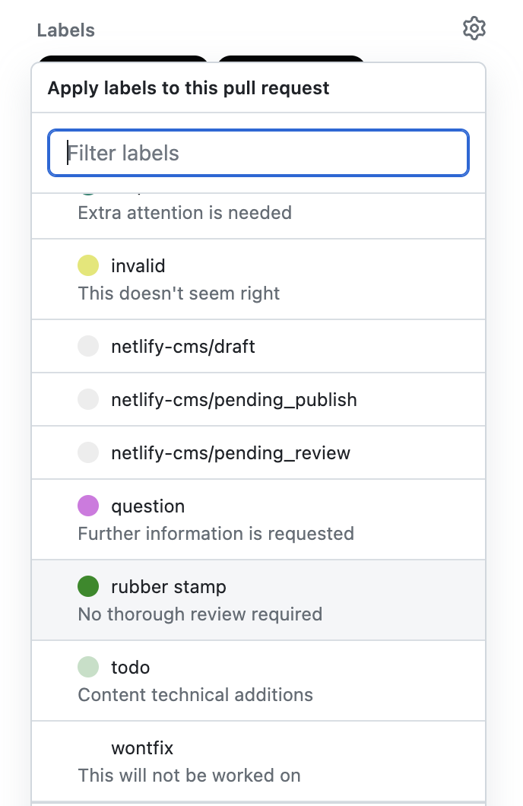

Reviews are a crucial step in the PR process, as they ensure that the code/content is of high quality and adheres to the  standards of the project. However, sometimes, developers encounter minor changes that do not require extensive reviews. In such cases, using a rubber stamp label can help expedite the PR approval process.

<!--endintro-->

The rubber stamp label signifies that the change can be approved without extensive scrutiny. It is typically used for minor changes such as typos, formatting issues, or small documentation updates. By using a rubber stamp label, we can save time on reviews.

::: img-small

:::

To use a rubber stamp label effectively, you must follow some best practices:

* **Only use the rubber stamp label for minor changes** - As mentioned earlier, the rubber stamp label is meant for minor changes only. Developers must ensure that the changes they make are truly minor and do not require in-depth reviews.
* **Ensure that the change adheres to other standards** - Even though the change is minor, it must still follow the project standards. Developers must ensure that their changes do not introduce any new issues or errors.

By following these best practices, developers can use the rubber stamp label to get their PRs approved quickly without compromising the quality of the project.

Here are the steps to use the rubber stamp label effectively:

1. Make the change and submit a PR
2. [Clearly describe the changes](/useful-information-on-changes)
3. Add the rubber stamp label to the PR. This means that the change can be approved without detailed review
4. Wait for the PR to be approved, **hopefully in less time than other PRs**... it will clearly show the label to reviewers 
5. Once the PR is approved, the changes will be merged into the codebase