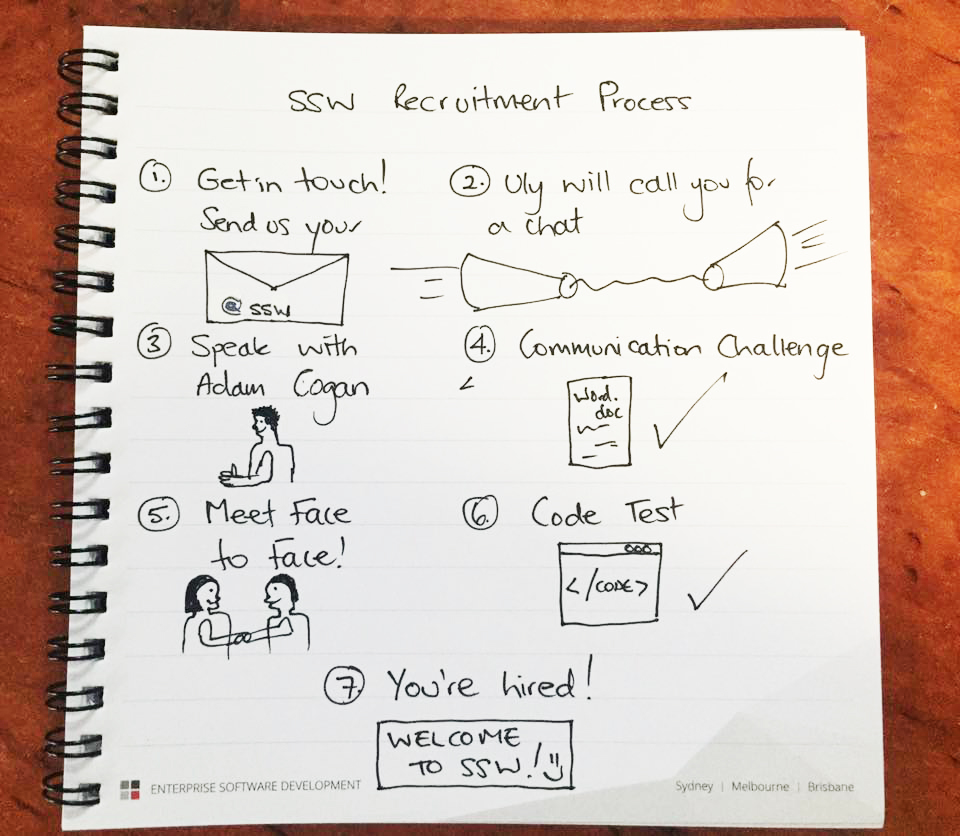

Trouble finding amazing developers?! Here is how we do it!

<!--endintro-->

At SSW we do not use recruiters, instead we rely on word of mouth for referrals, or we advertise a position using LinkedIn. We find that the filters on LinkedIn are a good way of attracting people with the correct skills. You can choose up to 10 skills per ad, saving you a lot of time.

We also try to make our ads interesting and fun to help them stand out. For example, when we needed a new State Manager for Brisbane, we wanted someone with a Business mind, who also knew our industry inside and out. So we created the title "A Business Guy (once a wannabe developer)". This got people's attention, and got us the right person for the job!

::: good
!\[Figure: Good example - Our "Business Guy" role as shown on our website](Business Guy.png)
:::

Once we have our candidates, we call them for a chat, put them through a communications challenge, and then a coding challenge. This ensures that we find people who are the right cultural fit for our company, as well as a kick-arse consultant and coder.

::: good

:::