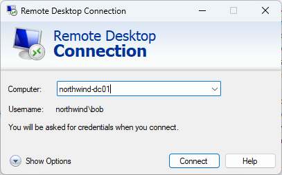
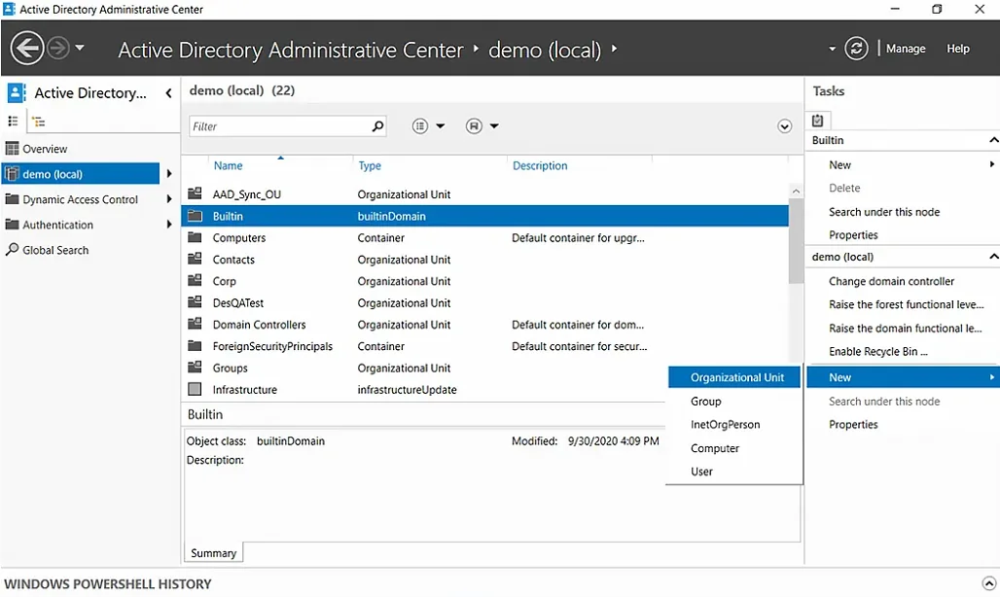

With more companies adopting BYOD policies, it is important for SysAdmins to be able to connect to Active Directory Users and Computers (ADUC) and other tools in a secure way, even if their computer is not connected to the domain.

<!--endintro-->

:::info
Note: You should make sure any personal devices connecting to your network are secure, with Intune or a similar solution. [Do you use Microsoft Intune?](implementing-intune/)
:::

## RDP to the Domain Controller (don't do this!)

The least secure way to do this is to use Remote Desktop Connection to make changes directly on the domain controller.

:::bad

:::

Another option is to connect to a different computer or server that is on the domain, like a jump box. This is a more secure solution, but for most companies it adds infrastructure that is not necessary.

## Windows Admin Center

Microsoft have a browser-based server management tool called **Windows Admin Center**. It is very useful for managing servers, and it can also be used to manage your AD environment - as well as DHCP, DNS and other Windows Server services.

Since the tool is browser-based, you only need to allow access to port 443 (or a custom HTTPS port).

::: good

:::

Read more about Windows Admin Center here: [Do you use Windows Admin Center?](/windows-admin-center)

## Running MMC from a non-domain joined computer