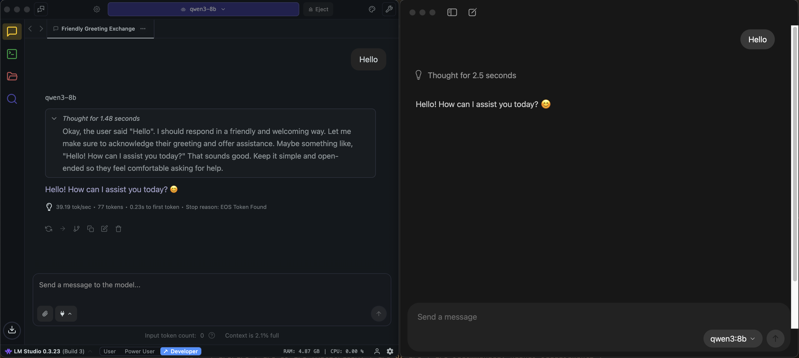

When you need AI assistance for development but find yourself offline (whether you're on a flight, gone camping, or facing the inevitable zombie apocalypse) you'll appreciate having local LLMs ready in your workflow!

Running LLMs locally unlocks ultimate freedom, through privacy, offline use, and control.

<!--endintro-->

## Why run LLMs locally?

Local LLMs ensure your data never leaves your machine, provide consistent performance without internet dependencies, and offer cost savings for high-volume usage.

### ✅ Benefits of local LLMs

* **Enhanced privacy** - Your code and data never leave your machine
* **Offline capabilities** - Work without internet connectivity
* **Cost control** - No per-token charges for high-volume usage
* **Customization** - Full control over model selection and fine-tuning
* **Consistent performance** - No API rate limits or service outages
* **Compliance** - Easier to meet regulatory requirements for data handling

### ❌ Limitations to consider

* **Hardware requirements** - Need sufficient RAM and GPU for good performance
* **Model size constraints** - Smaller models may have reduced capabilities
* **Setup complexity** - Requires technical knowledge for initial configuration
* **Updates** - Must manually update models and software

## Comparison

| Feature | [⭐️ Ollama](https://ollama.com) | [⭐️ LM Studio](https://lmstudio.ai) | [Microsoft Foundry Local](**https://learn.microsoft.com/en-us/azure/ai-foundry/foundry-local/what-is-foundry-local**) |
| --- | --- | --- | --- |
| Open Source? | Yes 😁 | No 😢 | No 😓 |
| UI | Simple chat and model management interface | Full desktop UI | CLI |
| Models | Large open‑source library (Llama, Mistral, Qwen, etc.) | GGUF downloads; curated catalog | Microsoft‑curated selection |
| Endpoint/API (OpenAI schema?) | Yes | Yes | Yes |
| Cost | Free | Free | Free; enterprise licensing may apply |
| Best for | Simple and lightweight, great for backends | Polished UX, great for experimentation | Enterprise integration in .NET ecosystem |

## Using Cline with your local Ollama or LM Studio models

Local LLMs can be used for code completion and assistance. This is especially handy when you want to perform [AI Assisted Development](/rules/ai-assisted-development-workflow/) without an internet connection.

Cline is an open source VSCode extension that adds AI enhanced workflows to your IDE, with comprehensive support for various model providers. 
We can link it up with LM Studio or Ollama without any complex configuration, simply clicking a button.

- Install the Cline extension.
- For Provider: Select either LM Studio or Ollama
- Select the model you would like to use
- Happy ~~vibe coding~~ AI assisted developing!

<video width="100%" height="auto" autoplay muted loop>
  <source src="cline-local.webm" type="video/webm">
  Your browser does not support the video tag.
</video>

**Figure: Using Cline locally with Qwen-3**

### Other open source AI coding tools worth mentioning:

**[GitHub Copilot](https://github.com/features/copilot)** - You've probably heard of it:

* One of the most popular extensions
* Works with Ollama models (not LM Studio)
* Closed source

**[Continue](https://continue.dev/)** - Open-source VS Code and JetBrains extension:

* Supports both Ollama and custom local models
* Provides autocomplete, chat, and edit features

**[Tabby](https://tabby.tabbyml.com/)** - Self-hosted AI coding assistant:

* No need to install an inference provider, fully self contained.
* Provides autocomplete, chat, and edit features

## Choosing the right model

### Model selection strategy

The open-source model landscape evolves rapidly, with new models released weekly that often surpass current leaders. 

Rather than recommending specific models that may become outdated, consider these resources for current information:

* **[Hugging Face Open LLM Leaderboard](https://huggingface.co/open-llm-leaderboard)** - Up-to-date rankings of the best open-source models
* **[Ollama Library](https://ollama.com/library)** - Filter by "Popular" to see community-validated models

### Hardware considerations

Model size (B = billion parameters) directly impacts hardware requirements:

* **1-7B** - Great for small context tasks requiring speed, e.g. reformatting text.
* **7-13B** - Great for getting started with local development, may not be viable for practical use-cases.
* **13-30B** - Sweet spot for local development with dedicated GPU
* **70B+** - God tier, requires high-end GPU and 64GB+ VRAM

::: info
**Note:** Without a powerful GPU, locally-run models may not produce code quality suitable for development work.
:::

## Best practices

* **Start small** - Begin with 7B parameter models like `codellama:7b` or `llama3:8b` to establish baseline performance, then upgrade or downgrade to meet that performance sweet-spot.
* **Test for your use case** - A model that excels at general text may not be optimal for specific programming languages
* **Check the leaderboards** -  Open source models are always improving, always make sure your chosen model is the best fit.
* **Consider hybrid approaches** - Use local models for sensitive data, cloud models for complex tasks

Running LLMs locally provides developers with powerful AI capabilities while maintaining control over their data and environment. 

Local LLMs have only recently been able to compete with closed source, cloud hosted ones.

Whether you choose Ollama for simplicity or Foundry Local for enterprise features, local LLMs provide ultimate freedom, and they're just getting started.
