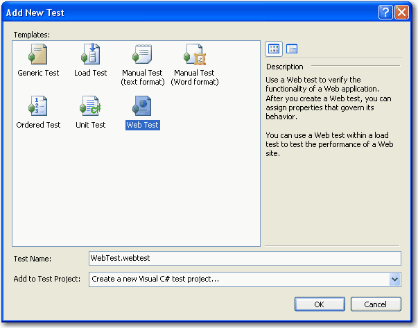
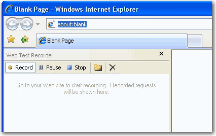
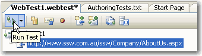
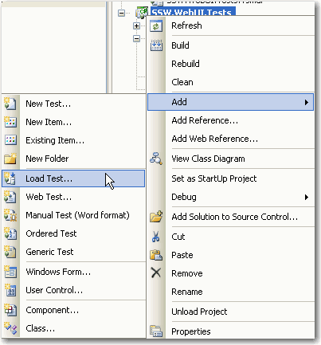
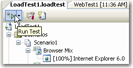

**explain the why**  what's the problem load testing helps to solve?

**explain the what** high-level of what load testing is

** remove old VS stuff? Current VS 2019 has load testing features, it's being EOL'd soon though so might not be worth keeping any of this, leave tooling to the other page**
**from other rule**
Load testing helps you ensure that your apps can scale and do not go down when peak traffic hits. Load testing is typically initiated for seasonal events such as tax filing season, Black Friday, Christmas, summer sales, etc.

Once you have a website up and running, it is important to make sure that it keeps running under load. Local testing of the website will not always reveal the latent problems in the website when it is subjected to thousands of users. Typical issues that result from inadequate load testing are:

* 503 Service Is Temporarily Unavailable
* Very slow load times
* Application Crashes due to:
    * Insufficient resources - so application pools are recycled
    * Too many concurrent users causing race conditions
    * Too many users trying to connect to the database

<!--endintro-->

Load Tests help you  **avoid these issues** by prompting them before you go live. Some issues might be resolved by getting a better web server, while others might require code changes and optimizations.

In  **Visual Studio 2005 - Software Testers Edition** , there is a built-in Test Project to conduct load testing.

1. From the  **Test** menu select  **New Test**
2. Select  **Web Test** and  **Create a new Test Project** 

  

3. Name the Test Project &lt;Namespace&gt;.WebUI.Tests
4. An Internet Explorer window will open with a recorder toolbar. Navigate to the web pages that need to be Load Tested

  

5. Click Stop when you are finished recording the pages to be tested
6. Click the  **Run** button to make sure the tests run

  

7. Add a new Load Test

  

8. Follow the  **Load Test Wizard**:
    * **Load Pattern** - Define the number of users hitting the site
    * **Test Mix** - Select the web test you recorded earlier
    * **Browser Mix** - Specify different types of browsers (leave as default)
    * **Network Mix** - Specify connection speeds of users (leave as default)
9. Click  **Finish**
10. Click  **Run** to run the load test

  

11. This will kick off the load test and show a live graph of user load, requests per second and response time
