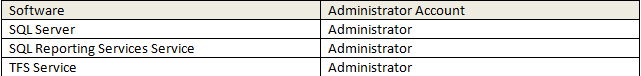
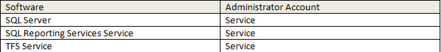
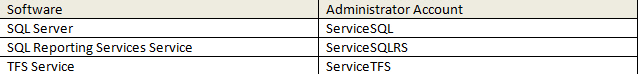
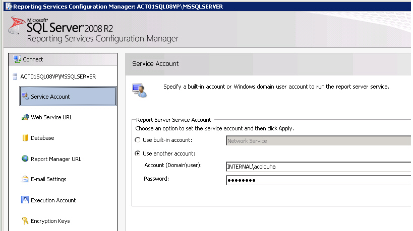
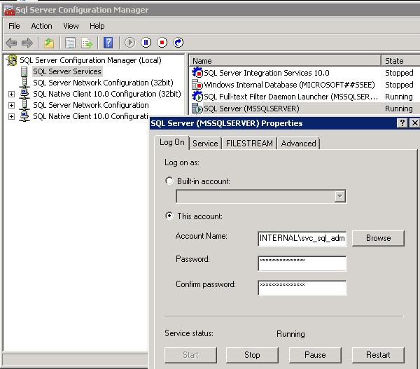

When [using service accounts](/do-you-use-service-accounts), you should have a specific AD account for each major service.

<!--endintro-->

::: bad

:::

::: ok\

:::

::: good

:::

::: bad 

:::

::: good

:::