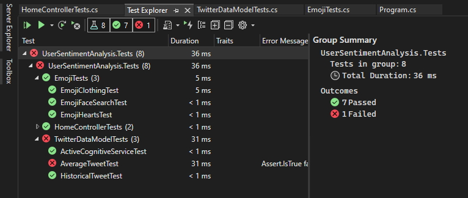

When you build the test project in Visual Studio, the tests appear in Test Explorer. If Test Explorer is not visible, choose Test | Windows | Test Explorer.

<!--endintro-->

As you run, write, and rerun your tests, Test Explorer displays the results in default groups of Failed Tests, Passed Tests, Skipped Tests and Not Run Tests. You can change the way Test Explorer groups your tests.
You can perform much of the work of finding, organizing and running tests from the Test Explorer toolbar.

You can run all the tests in the solution, all the tests in a group, or a set of tests that you select. Do one of the following:

* To run all the tests in a solution, choose Run All
* To run all the tests in a default group, choose Run... and then choose the group on the menu
* Select the individual tests that you want to run, open the context menu for a selected test and then choose Run Selected Tests.

The pass/fail bar at the top of the Test Explorer window is animated as the tests run. At the conclusion of the test run, the pass/fail bar turns green if all tests passed or turns red if any test failed.

Tip: If you are using dotnet Core/5+ you can do this from the terminal by running *dotnet test*