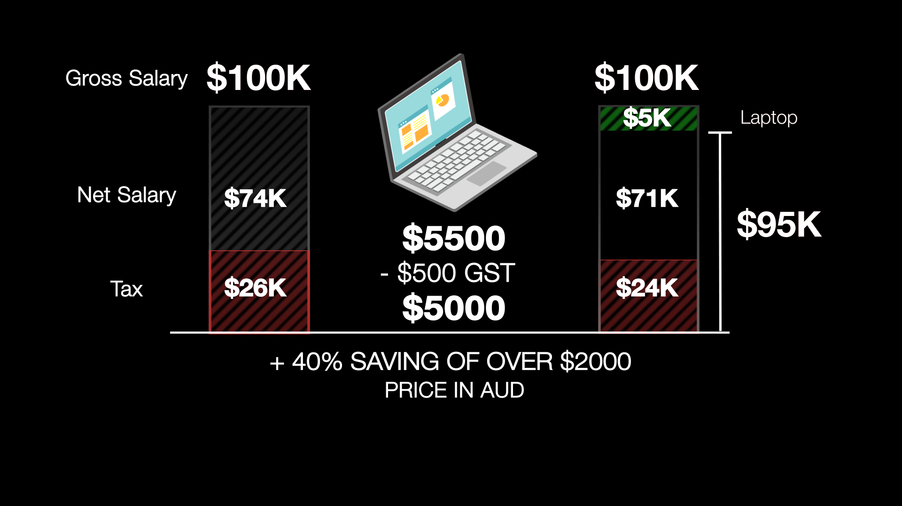

Are you planning to buy a cool laptop to boost your productivity? You can place your order from Apple or JB HiFi at full price. Or if your employer offers the ability to Salary Sacrifice, you can spend less by paying with your **pre-tax** money (rather than after-tax).

`youtube: https://youtu.be/ORTMJoyX_fg`
**Video: Pay Less Tax with Salary Sacrificing! | Electronic Devices (4 min)**

### What is salary sacrificing for electronic devices

In Australia, salary sacrificing is when your employer agrees to pay for your device(s) with your pre-tax salary, therefore you pay less tax.

Most companies will let you salary sacrifice FBT-exempted ([Fringe benefit tax](https://www.forgov.qld.gov.au/finance-and-procurement/finance-travel-and-assets/taxation-and-financial-management/manage-taxation/fringe-benefits-tax-fbt)) portable electronic devices that:

* Are used predominantly for work-related purposes
* Are easily portable and designed for use away from an office environment
* Are small and light
* Can operate without an external power supply
* Are designed as a complete unit

This provides you with a wide variety of work-related devices that you could salary sacrifice and save money on. Some devices such as laptops, tablets, phones, and headphones are just some of the examples.

Accessories (such as cases and chargers) can be included in a salary sacrifice arrangement only if they are necessary for the basic operation of the electronic device. Accessories bundled into the price by the retailer can be included in the arrangement.

### The benefits of salary sacrifice

Salary sacrificing has many awesome benefits:

✅ You pay for your devices in pre-tax dollars (a saving of approximately 30% depending on your tax bracket)

✅ You don’t pay GST (saving you another 10%)

✅ Less admin - Nothing for you to do at tax time

✅ You get to choose your device - and you own it

✅ You can get something with more powerful than you could have without the savings

::: info
**Tip:** As an added benefit, both you and your company can coordinate to [incorporate some branding into the asset](/brand-your-assets) through salary sacrifice.
:::

#### Scenario

Bob is earning $111k per annum (salary package inclusive of $11k Super). He wants to buy a $5,500 laptop.\
Let's look at how he saves **$2,500** on the new laptop.

|                                   | ❌ Without Salary Sacrificing | ✅ With Salary Sacrificing |
| --------------------------------- | ---------------------------- | ------------------------- |
| Salary package inclusive of Super | $ 111k                       | $ 111k                    |
| Less Super                        | $ 11k                        | $ 11k                     |
| Pre-tax deduction                 | $ 0                          | $ 5k                      |
| Gross Income                      | $ 100k                       | $ 95k                     |
| Less Tax                          | $ 26k                        | $ 24k                     |
| 💻 Purchase                       | $ 5k                         | $ 0                       |
| 💻 GST on Purchase                | $ 0.5k                       | $ 0                       |
| **Take-home pay**                 | **$ 68.5k**                  | **$ 71k**                 |

**Figure: Bob saved $2,500 on take-home pay with salary sacrificing**
