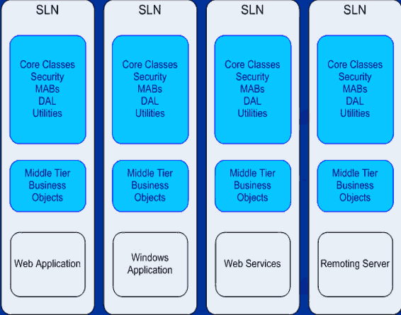

There are various ways of organizing your code for large .NET projects in Visual Studio.

<!--endintro-->


1. First option would be to put all the projects in a single solution, reference projects using project references.

   

   Putting all the projects into a single solution and reference the projects using project references has the following advantages and disadvantages:

   **Advantages**

   * The main advantage of having project references is that it can support multiple versions quite well.
   * Other advantages include the fact that it can be a lot more reliable and switch-able.

   **Disadvantages**

   There are, however, two major disadvantages in adding many projects to one single solution.

   * It is not scalable. Having 240 projects would take 1 hours and 30 minutes to load and to build in one solution, so it can be very difficult to allow that kind of a solution to continually grow.
   * Middle tier could possibly have 100's of IP addresses.
   * It is not efficient to load that entire time as mentioned above. In general one solution can efficiently handle 60 projects.

2. Another option would be to create separate solutions for each application, i.e. have a Windows Solution, a separate ASP.NET Web App Solution etc.. each solution referencing the middle tier and base system projects.

   

   **Advantages**

   * The main advantage of having separate solutions for each application is that there will be less load time than the 1st option mentioned.
   * Multiple versions can also be supported.
   * Switching between debug and release is relatively easy.

   **Disadvantages**

   The fact that the application is being build 4 times would make build time significantly longer. Other problems include:

   * Applications trying to load versions which could change during the build time. However this could be worked-around by not allowing auto-increment of the Assembly info Version Number, i.e. instead of "2.0.*", removing the star ("2.0") will prevent increments of the version number.
   * It is not efficient repeating the build in each solution as mentioned above.
   * It is not scalable, or reliable.

   If there are no signed assemblies, make sure there are dynamic assemblies. The application must be build once so there are no differing versions of these assemblies. The contents of exactly what's in each assembly must be known.

3. Mick's Recommended Approach

   

   The recommended approach

   1. Each project goes into a single solution.

      * This is determined by grouping projects depending on the dependencies.
      * The Data Access solution is build first, then the Middle Tier depends on the first solution. Applications depends on both.
      * Developers don't want to change too much, so these layers should be kept invisible from them.
   2. Each solution references assemblies from a single staging area.

      * Developers don't need to look at the data access. The applications will get the assemblies directly from the staging area.
      * Assemblies found in the staging area are only locked when the underlying layers are being rebuilt.
   3. Staging areas are mapped to a drive letter using the dos command "Subst" or a network share.

      * Mapping to the path is more flexible in gaining access to the staging area and modifying it.
      * Instead of having long paths, it is recommended to have one drive letter regardless of the version. This would allow switching between debug and release easier, as well as switch between versions.
      * File references are solved with having the same drive letter.
      * These drives that are mapped are made by scripts that are run. The script also includes putting the files straight into source safe. e.g.

        ```bash
        $ log:$ \[- SourceSafe Admin]
        ss option
        expand keyword "\*.cs" "\*.vb" "*.xml"
        ```
      * There would also be a set of macros that are specificly created to:

        * Clean the proj.
        * Clean the sln.
        * Mass Rename.

   Create solutions which group projects by there dependencies as mentioned above.

   **Advantages**

   * Each project is only built once, speeding the build and eliminating problems with versioning between .NET assemblies.
   * Referencing from a single drive letter helps simplify the problems with using file references
   * The use of "subst" and mapped network drives allows flexibility of easily the location from which a solution is referencing its assemblies.
