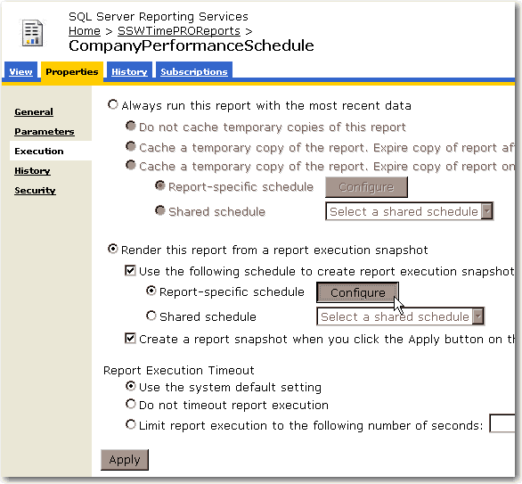

A report should never take more than 30 seconds to run. Slow reports frustrate users, and also take valuable server performance away from the report server.

<!--endintro-->

When dealing with slow reports, it is a good idea to setup scheduled snapshots. As an example,  you would schedule a long running report to create a snapshot at night when the server is idle and not under a lot of stress. We recommend creating new snapshots every night so that the information displayed in the reports is never more than 24 hours old.

As an example:

**Do** create a snapshot for a sales summary
**Do not** create a snapshot for an invoice report

For information on setting up scheduled snapshots see the following [KB article](http://www.ssw.com.au/ssw/KB/KB.aspx?KBID=Q1119699)

