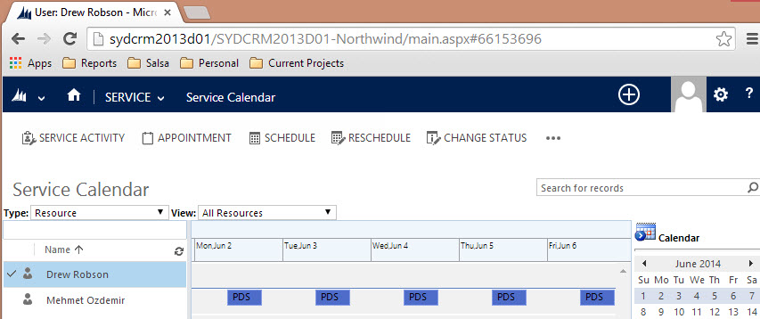

As an Account Manager, you'll frequently be required to find a free resource to put onto a project.

::: bad

:::

Instead of going around and asking everyone _“Who’s free next week?”_, you should use the CRM Service Calendar.

The calendar provides a one page view of everyone’s availability for a given time period. Here’s what you need to do to access it:

<!--endintro-->

1. Go to your company's CRM, e.g. [http:// crm.ssw.com.au](http://crm.ssw.com.au)
2. Click Service | Service Calendar
3. Choose Month, Week, or Day view to suit your needs

All of the Appointments in the Service Calendar will also sync to the developers' Outlook calendars, keeping them up to date with where they need to be, when.

You have multiple options for ways to fill this data, which you can see in [Scheduling - Do you know how to book developers for a project?](/scheduling-do-you-know-how-to-book-developers-for-a-project)

**Suggestion to Microsoft:** One limitation of CRM is that you cannot send a URL to this page to someone, so they will have to navigate to it themselves.
