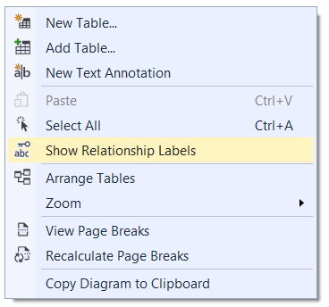

​​​​​​​​You should not provide a database schema via several screen captures - it has little information about the details. A well-formatted Word document may be providing more details information, but it is not easy to maintain the document to keep it up-to-date. The best way is to automatically generate your document with a tool. 

 <excerpt class='endintro'></excerpt> 

We recommend and use <a href="https://www.ssw.com.au/ssw/Standards/DeveloperGeneral/SQLservertools.aspx#SqlDoc">Red-Gate SQL Doc</a> to produce chm help files or html pages of the database schema. SQL Doc also allows you to run via the command line so you can include the generation in your build process to be automatically created.

We have also have used other available tools in the past, such as <a href="https://www.ssw.com.au/ssw/Standards/DeveloperGeneral/SQLservertools.aspx#ApexSqlDoc">Apex SQL Doc</a>.​ 

Alternatively, you can use SQL Management Studio to generate a Database diagram. 1.	Connect to your database using SQL Server Management Studio 2.	Create a new Database Diagram, by right-clicking <strong>Database Diagrams</strong>
<dd class="ssw15-rteElement-FigureNormal"><dl class="ssw15-rteElement-ImageArea"></dl>Figure: New Database Diagram </dd>
3.	A popup will appear. Shift-Click to select all the tables then click <strong>Add</strong>
<dl class="ssw15-rteElement-ImageArea"></dl><dd class="ssw15-rteElement-FigureNormal">Figure: Selecting tables for diagram </dd>
4.	You will see tables populate behind the dialogue box, once complete click <strong>Close</strong>
<dl class="ssw15-rteElement-ImageArea"></dl><dd class="ssw15-rteElement-FigureNormal">Figure: Tables populated </dd>
5.	Click off the tables in the diagram and <strong>Ctrl+A</strong> to Select all 6.	Right-Click one of the tables in the diagram and perform the following 
<blockquote style="margin:0px 0px 0px 40px;border:none;padding:0px;">
a.	​Select <strong>Table View | Standard</strong> from the menu 

b.	​​Select <strong>Autosize Selected Tables</strong> from the menu  
<dl class="ssw15-rteElement-ImageArea"></dl><dd class="ssw15-rteElement-FigureNormal">Figure: Changing the database table diagram to Standard View and Autosize​ </dd></blockquote>
7.	Right-click the diagram background and select <strong>Show Relationship Labels</strong>
<dl class="ssw15-rteElement-ImageArea"></dl><dd class="ssw15-rteElement-FigureNormal">Figure: Show Relationship Labels </dd>
8.	Move the tables around so that the Relationship Labels are clearly visible. 

<strong>Note: </strong>You will need to screenshot the diagram as using the copy to clipboard function removes the “Allow Nulls” checkmarks.  
<dl class="ssw15-rteElement-ImageArea"></dl><dd class="ssw15-rteElement-FigureNormal">Figure: Northwind Database Schema </dd>
  

  

