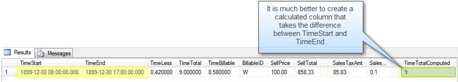

When you have a denormalized field, use a computed column.  In SQL Server they can be persisted.

Use the suffix "Computed" to clearly distinguish that this field is a computed field.

<dl class="badImage"><dd>Figure: Bad Example - This field was manually updated from code in the middle tier. </dd></dl><dl class="goodImage">&lt;dt&gt;
      
   &lt;/dt&gt;<dd>Figure: Good Example - There was no code in the middle tier to calculate this (and it has the correct name)  </dd></dl>
<!--endintro-->

Computed columns have some limitations - they cannot access fields in other tables, or other computed fields in the current table.

You can use user-defined functions (UDF) from code in a reusable function, this allows one computed column to use a function to call another function.  Here is an example:

ALTER FUNCTION [dbo].[udfEmpTime\_TimeTotalComputed]

(
@TimeStart as DateTime,
@TimeEnd as DateTime     
)
RETURNS DECIMAL(8,6)
AS
BEGIN
-- This function returns the time difference in hours - decimal(8,6)
RETURN (round(isnull(CONVERT([decimal](8,6),@TimeEnd - @TimeStart,(0))\*(24),(0)),(2)))

 END
 **Figure: This is the user defined function
** <dl class="image">&lt;dt&gt;&lt;/dt&gt;<dd>Figure: Setting up a computed column in the table designer   </dd></dl>
