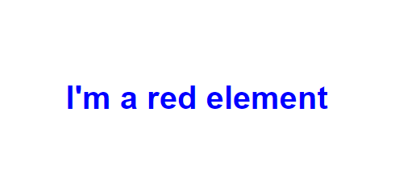

On large frontend projects with lots of components it's common to have issues with your CSS classes overwriting each other or conflicting. 
There are a few different ways to solve this.

<!--endintro-->

It can be very frustrating when CSS classes overwrite and behave differently to how we want them to.

  

Debugging this can be a nightmare on larger projects with huge amounts of styling as you need to comb through the entire file to find what's overwriting the style.

```css
h1 {
  color: red;
}

/* 3000 more lines of code... */
```

### Utility Classes

One solution to this problem is using a CSS framework such as [Tailwind](https://tailwindcss.com).

#### Benefits
* Faster setup
* Simple to use
* Faster development speed once devs are familiar with it

#### Disadvantages
* Poor readability as you add more classes
* Learning curve for class names

### Scoped CSS

Most frontend frameworks such as Blazor, Angular and React support scoped CSS, allowing you set CSS classes on a component level.

When you create a scoped CSS file, those classes are only accessible to the component that the CSS file is associated with.  

This is useful as you don't need to worry about class names or CSS values conflicting with eachother like you would if all the classes are set at the root level.
It also makes it much easier to change styling on individual components without breaking the styling on other classes.

#### Benefits
* Can reuse class names in each component without conflicts

#### Disadvantages
* Styles have to be manually written

#### Blazor

In Blazor scoped CSS files are associated with components with dot syntax.  
For example, if we have a component called `MyComponent.razor`, we can create a file called `MyComponent.razor.css` and the classes set in that file will only apply to `MyComponent`.

##### Inheritance

Blazor supports having scoped CSS classes inherited by child components.

```cs
<MyComponent>
  <MyChildComponent />
</MyComponent>
```

In `MyComponent.razor.cs`, if we use the `::deep` psuedo selector on a class, it will be applied to `MyChildComponent`.

```css
::deep .myClass {
  /* Styling goes here */
}
```

[Blazor CSS Isolation - Microsoft Docs](https://learn.microsoft.com/en-us/aspnet/core/blazor/components/css-isolation?view=aspnetcore-7.0)

#### Angular

When you create a component in Angular, a scoped CSS file is automatically created for it along with the HTML and TypeScript files.

```md
myComponent
|- myComponent.component.html
|- myComponent.component.css
|- myComponent.component.spec.ts
|- myComponent.component.ts
```

##### Inheritance

Angular also offers the `::ng-deep` pseudo selector, but there are [some considerations](https://angular.io/guide/component-styles) when using this.

[Component Styles - Angular Docs](https://angular.io/guide/component-styles)

#### React

We can achieve local, component-level styles in React by using importing from a file ending in `module.css`: 

```css
/* component.module.css */

.heading {
  font-weight: 700;
}
```

```jsx
import styles from "component.module.css";

const Component = () => {
  return (
    <h1 style={styles.heading}>Bold Heading Here</h1>
  )
}
```

This will then render the element with a component specific class, differentiated from other `.heading` elements:

```html
<h1 class="Component_heading__nEBhk">Bold Heading Here</h1>
```
