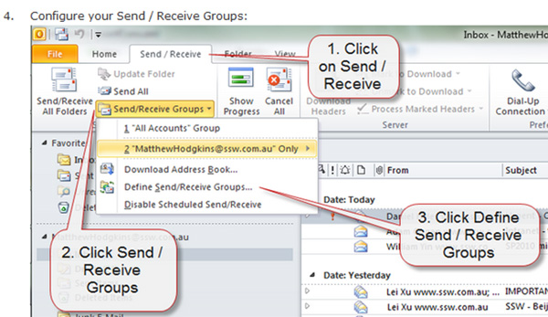
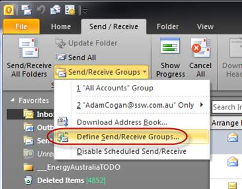

Some people communicate with a 'Wall of Text'. Communicate better by using screenshots and reduce your amount of words. 

You can take screen captures to the next level by adding balloons that have the appropriate text (aka speech bubbles). Sometimes you need only the text in the balloon and no text in the email.

The balloon is great because you can point to a specific part of the image. It is much easier than reading the old ‘Wall of Text’.

Let's look at bad and good examples:

<!--endintro-->

[[badExample]]
| 

[[goodExample]]
| 
See more details on     [how to configure balloons branding in Fullshot and Snagit](/Pages/HowToConfigureBalloonBranding.aspx).

Now be aware not to go crazy with this balloon rule.

[[badExample]]
| 

[[goodExample]]
| 

[[goodExample]]
| 

`youtube: https://www.youtube.com/embed/5TB61bqQKtE`
Figure: Good Example – Betsy Weber Techsmith - Part 1 - Creator of Snagit. See     [full series here](http://tv.ssw.com/204/betsy-weber-teched-interview)
