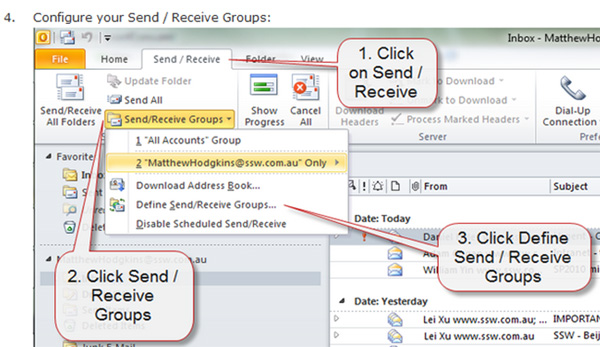
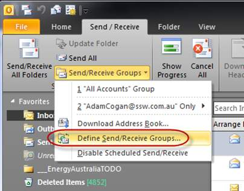

Communicating effectively often involves moving away from lengthy 'Walls of Text'. Instead, using screenshots can convey the message more succinctly and efficiently, reducing the reliance on excessive wording.

Consider the following points:

* Efficiency - Screenshots enable people cc’ed to check the task by quickly skimming, not needing to click on links.
* Capture the moment - Tasks can take time to get to, often weeks or months! Reports and dashboards change over time and without a screenshot, a developer probably won't know what the person was looking at.
* Clear and concise - Screenshots are like the ‘x’ in  the useful format of change x to y (see related rules) Make the task as clear as possible!

You can take screen captures to the next level by adding balloons that have the appropriate text (aka speech bubbles). Sometimes you need only the text in the balloon and no text in the email.
The balloon is great because you can point to a specific part of the image. It is much easier than reading the old ‘Wall of Text’.

<!--endintro-->

Going further, there are ways to improve the readability of your screenshots:

### Tip #1: Avoid blank spaces

By cropping empty spaces in screenshots, you can make things easier to read and understand. Most times you can achieve this by resizing the application window before taking the screenshot.

It's like zooming in on the important bits, making them bigger and friendlier for the users.

::: bad

:::

::: good

:::

### Tip #2: Add a balloon when you need to point at a specific area of your screenshot

::: bad

:::

::: good

:::

::: info
See more details on [how to configure balloons' branding in Fullshot and Snagit](/screenshots-add-branding).
:::

### Tip #3: Be aware not to overuse balloons

::: bad

:::

::: good

:::

::: good

:::

In other words, you can use:

* Plain screenshots
* Balloons
* Circles or boxes
* Arrows

They are all useful depending on the scenario. Be wise and try to make it as clear as possible to the reader.

### Tip #4: Add branding to screenshots

Follow the rule [Do you add branding to screenshots?](/screenshots-add-branding)

`youtube: https://www.youtube.com/embed/5TB61bqQKtE`
**Figure: Betsy Weber Techsmith - Part 1 - Creator of Snagit. See [full series here](http://tv.ssw.com/204/betsy-weber-teched-interview)**

## Do you know the best tools?

Follow the rule [Screenshots - Do you know the best tools?](/screenshots-tools)
