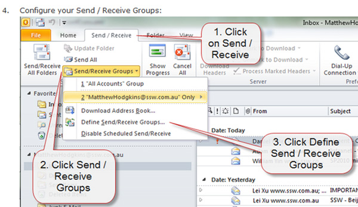
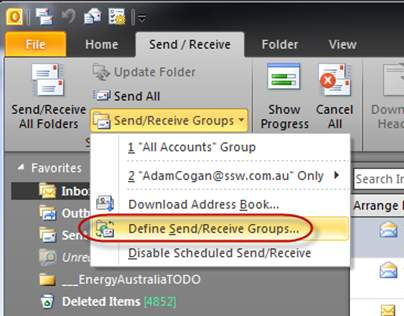

Some people communicate with a 'Wall of Text'. Communicate better by using screenshots and reduce your amount of words. 

You can take screen captures to the next level by adding balloons that have the appropriate text (aka speech bubbles). Sometimes you need only the text in the balloon and no text in the email.

The balloon is great because you can point to a specific part of the image. It is much easier than reading the old ‘Wall of Text’.

<!--endintro-->

Going further, there are ways to improve readability of your screenshots:

### Tip 1: Add a balloon when you need to point at an specific area of your screenshot

::: bad

:::

::: good

:::

::: info
See more details on [how to configure balloons branding in Fullshot and Snagit](/add-branding-to-screenshots).
:::

### Tip 2: Be aware not to overuse balloons!

::: bad

:::

::: good

:::

::: good

:::

In other words, you can use:
- Plain screenshots
- Balloons
- Circles or boxes
- Arrows 

They are all useful depending on the scenario. Be wise and try to make it as clear as possible to the reader.

### Tip 3: Add branding to screenshots

Follow the rule [Do you add branding to screenshots?](/add-branding-to-screenshots)

`youtube: https://www.youtube.com/embed/5TB61bqQKtE`
**Figure: Betsy Weber Techsmith - Part 1 - Creator of Snagit. See [full series here](http://tv.ssw.com/204/betsy-weber-teched-interview)**

## Do you know the best tools?
Follow the rule [Screenshots - Do you know the best tools?](https://www.ssw.com.au/rules/edit-screenshots)