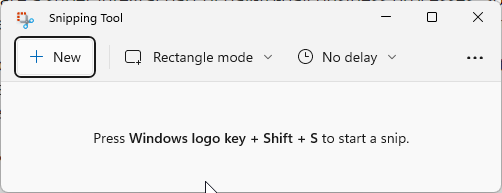

A picture says a thousand words, so using screenshots to provide context is invaluable. However, it isn't always clear to others what part of the screenshot they need to be looking at. So, it is important that you edit your screenshots to add extra info such as highlighting critical information.

Windows provides a default tool for taking and editing screenshots called the Snipping Tool. However, it is quite limited in functionality. For example, it doesn't provide the ability to draw a neat rectangular box quickly and easily.

<!--endintro-->

There are heaps of great tools that provide much more advanced functionality. The best tools are

::: greybox
⭐ [Snagit](https://www.techsmith.com/screen-capture.html) - Recommended

✅ [ShareX](https://getsharex.com/)

✅ [GoFullPage](https://chrome.google.com/webstore/detail/gofullpage-full-page-scre/fdpohaocaechififmbbbbbknoalclacl) (Chrome Extension)

✅ [Greenshot](https://getgreenshot.org/)

✅ [Lightshot](https://app.prntscr.com/en/index.html)

✅ [Fullshot](http://www.inbit.com/downloadfullshot.html)

✅ [Flameshot](https://flameshot.org)

✅ [Shottr](https://shottr.cc) (MacOS only)

❌ [Preview](https://support.apple.com/en-au/guide/preview/welcome/mac) (MacOS only - built-in)

❌ [Snipping Tool](https://support.microsoft.com/en-AU/windows/use-snipping-tool-to-capture-screenshots-00246869-1843-655f-f220-97299b865f6b) (Windows only - built-in) 
:::

Source: [Google Trends](https://trends.google.com.au/trends/explore?q=screenshot%20snagit,screenshot%20lightshot,screenshot%20sharex,screenshot%20greenshot,screenshot%20fullshot)

::: bad

:::

::: good

:::
