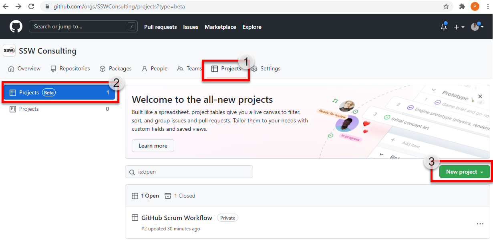
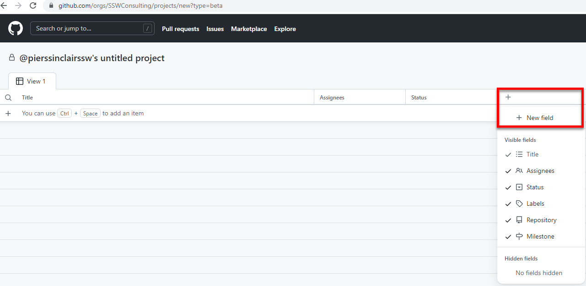
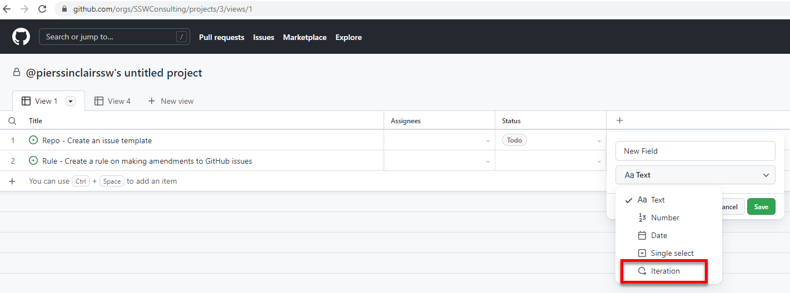
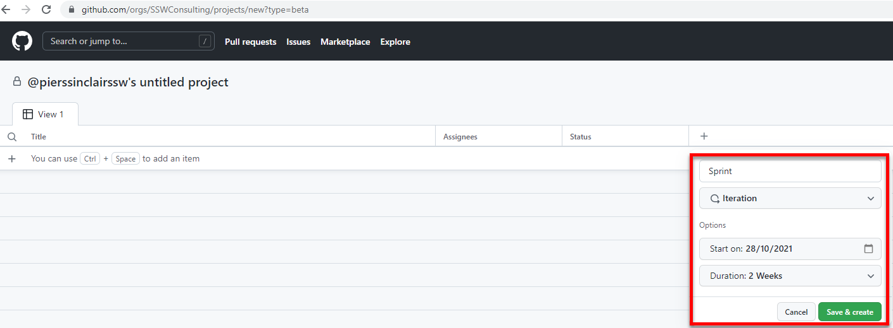
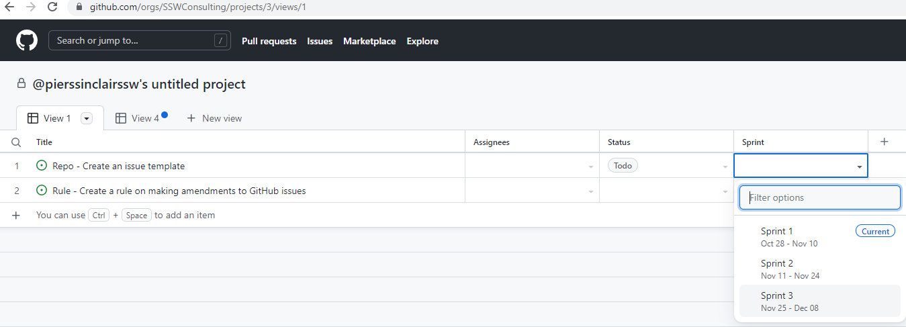
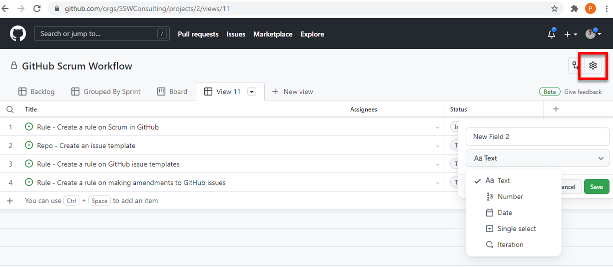
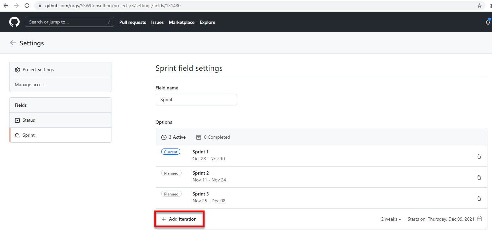
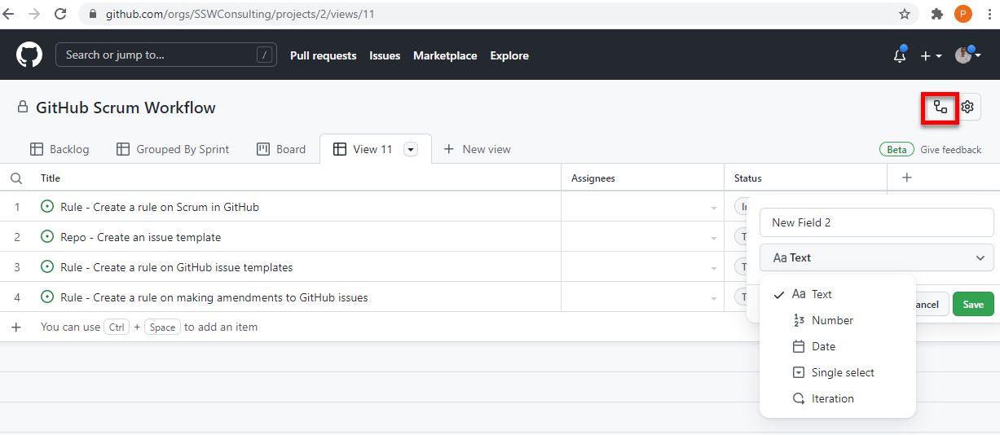
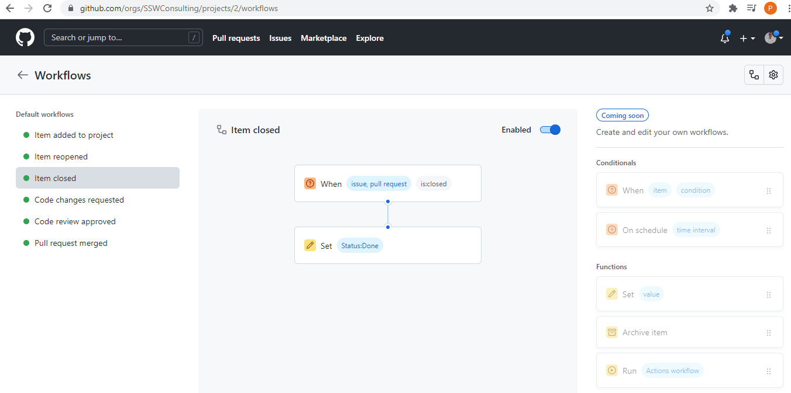

GitHub is an awesome place to manage your code, but until recently it hasn't been the easiest place to manage your Scrum workflow. GitHub projects is looking to solve this problem.

<!--endintro-->

GitHub projects lets you create sprints easily and manage tasks across multiple repositories fluidly. Let's walk through how to setup an awesome Scrum workflow in GitHub projects.

1. Navigate to **Projects | Projects (Beta) | New project**

   
2. Now we have a blank slate, we need to setup our sprint iterations. Navigate to **+ | + New field**

3. Select the **Iteration** field type

4. You will see a little window with options for your new iteration, name it **Sprint** and input **Start on** and **Duration** for your sprint.

5. Now add some PBIs to the project and then you can assign your PBIs to the iteration of your choice by clicking the drop down in the **Sprint** field.

**Note:** You can even add PBIs from many different Repos

6. If you want to add more Iterations to your project, navigate to Settings | Fields | Sprint | Add iteration

**Note:** You can also change **Starts on** and **Duration** here

7. To give yourself a better view of things, you might want to create a view that groups by sprint. Name your current view **Backlog** then create a new view and name it **Sprints**

8. Click the view drop down and select **group:Sprint** and **sort:Status-asc** , now it will show sprints grouped and ordered by task status

9. Voila! You have your Scrum workflow all setup! For bonus points check out the workflow screen where you can automate parts of your issue workflow

