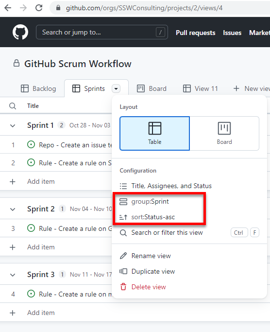

GitHub is an awesome place to manage your code, but initially it wasn't the easiest place to manage Scrum.  Things improved in 2021 with GitHub Projects. 

GitHub Projects lets you create Sprints and manage Issues (aka PBIs or Tasks) across multiple repositories. 

Follow these steps to get up and running:

<!--endintro-->

1. Navigate to **Projects | Projects (Beta) | New project**

1. Now we have a blank slate, we need to setup our Sprint (they call them Iterations). Navigate to **+ | + New field**

3. Select the **Iteration** field type

4. You will see a window with options for your new Iteration, name it **Sprint** and enter **Start on** and **Duration**.

5. Now add some Issues to the project and then you can assign them to the correct Sprint, by clicking the drop down in the **Sprint** field.

**Note:** You can even add Issues from different Repos

6. To add more Sprints, navigate to **Settings | Sprint | Add iteration**

**Note:** You can also change **Starts on** and **Duration** here

7. To give yourself a better view of things, you might want to create a view that groups by Sprint. Name your current view **Backlog** then create a new view and name it **Sprints**
8.  To see the Sprints grouped, and the issues ordered by status, click the view drop down and select **group:Sprint** and **sort:Status-asc** 

9. Voila! You have Scrum all setup! For bonus points check out the workflow screen where you can automate parts of your issue workflow

