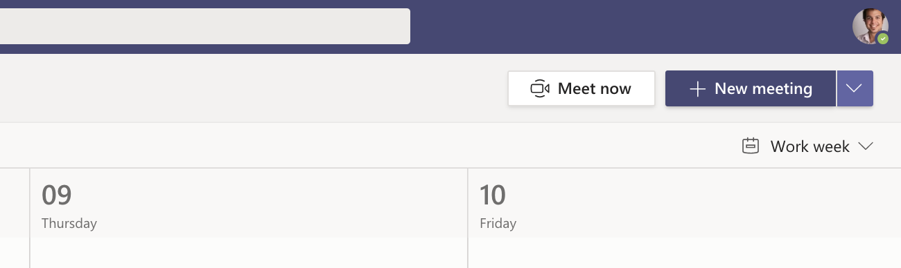

The Scrum Master (not ScrumMaster), must schedule the Sprint Review, Retrospective and Planning meetings.

<!--endintro-->

Estimate how much time each meeting will require, then schedule a single calendar appointment to cater to the three meetings. When scheduling the calendar appointment, keep in mind the following:

* Ideally, each of the three meetings should be time-boxed to an hour for every week of their associated Sprint.
* This timeboxing does not mean the whole time will be taken up, just that you should not let the time for each meeting be exceeded.
* With the Product Owner's help, the Scrum Team will need some time to update the Product Backlog after the Retrospective and before the Planning meeting.
* People need breaks.
* The Sprint officially finishes at the end of the Sprint Retrospective meeting. The Sprint Planning meeting marks the beginning of the next Sprint.
* These meetings do not necessarily have to be held on a Friday or Monday. You can have a Sprint start and end on any day of the week.
Mid week meetings are recommended so that the likelihood of it occurring on a public holiday long weekend is minimised.
* Since these meetings will occur every Sprint - set a recurrence on the calendar appointment (every 1, 2, 3, or 4 weeks) so that people have the time blocked out well in advance.

::: greybox
**Tip:** It can be helpful to finish the Sprint Planning meeting with the first Daily Scrum
:::

Schedule the meeting and invite the Scrum Team and any interested stakeholders.

::: email-template  
|          |     |
| -------- | --- |
| Required Attendees:      | Scrum Team |
| Optional Attendees:      | Interested Stakeholders |
| Recurrence:     | Every  **\[Number of weeks in the Sprint\]** weeks |
| Subject: | \[Project Name\] – Sprint Review, Retro and Planning |  
::: email-content  

### Hi Team,
 
This is a calendar appointment to hold the following three Scrum meetings:
 
**Sprint Review Meeting** 
We will go through the user stories that have been completed and demonstrate them.
See rule [What happens at a Sprint Review Meeting](/do-you-know-what-happens-at-a-sprint-review-meeting)? 
 
**Sprint Retrospective Meeting** 
Sprint closed and new sprint starts.
We ask for feedback of the previous sprint so that we can ‘Inspect and Adapt’.
See rule [What happens at a Sprint Retrospective Meeting](/do-you-know-what-happens-at-a-sprint-retrospective-meeting)? 
 
**Sprint Planning Meeting** 
We go through the backlog (aka to-do list), get more information, estimate and then prioritize. 
We then breakdown to tasks and commit to what we believe we can deliver for the next sprint.
See the rule [What happens at a Sprint Planning Meeting](/do-you-know-what-happens-at-a-sprint-planning-meeting)?

Regards,
\[Scrum Master\]

&lt;This email is as per the rule [https://www.ssw.com.au/rules/scrum-master-do-you-schedule-the-3-meetings](/scrum-master-do-you-schedule-the-3-meetings) /&gt;

:::  
:::  
::: good
Figure: Good Example - copy this appointment template and send to the Scrum Team
:::

::: good  
  
:::

See [Meetings - Do you know when to send an Appointment or a Teams Meeting?](/send-appointment-or-teams-meeting) for more information.

::: greybox
In Scrum, there are 4 meetings in total that you need to know about:
* [Sprint Planning Meeting](/do-you-know-what-happens-at-a-sprint-planning-meeting "Sprint Planning Meeting")
* [Daily Scrum Meeting](/meeting-do-you-update-your-tasks-before-the-daily-scrum "Daily Scrum Meeting") (Stand-up)
* [Sprint Review Meeting](/do-you-know-what-happens-at-a-sprint-review-meeting "Sprint Review Meeting")
* [Sprint Retrospective Meeting](/do-you-know-what-happens-at-a-sprint-retrospective-meeting "Sprint Retrospective Meeting")
:::
