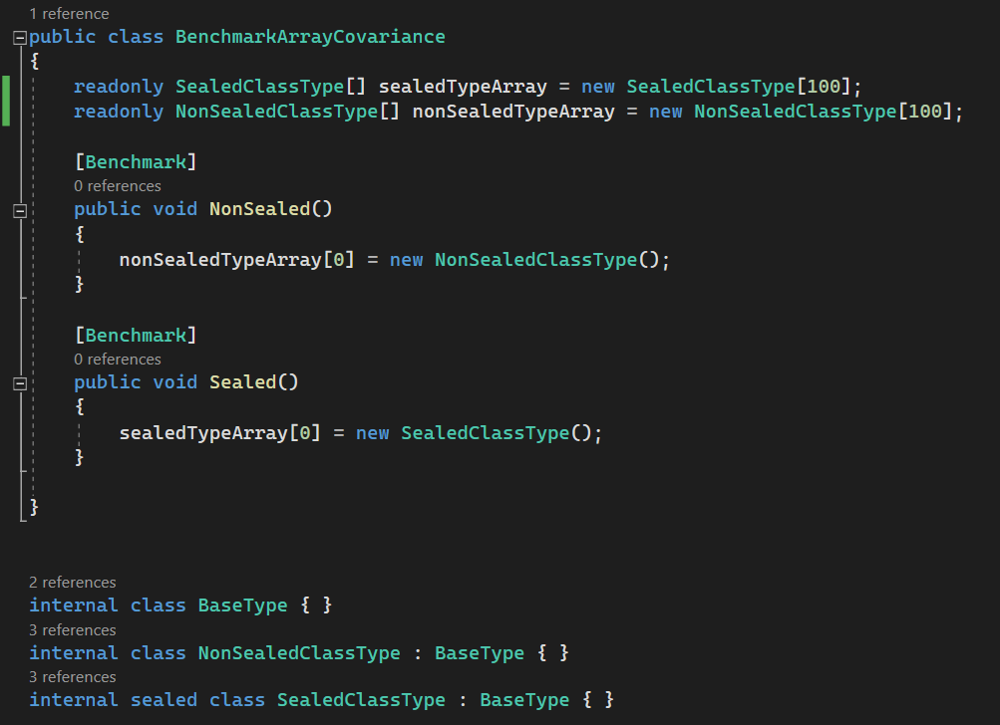
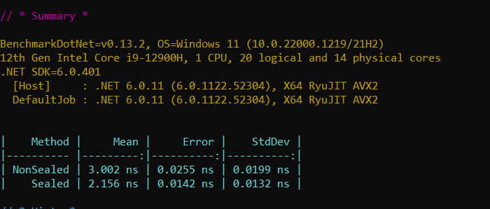
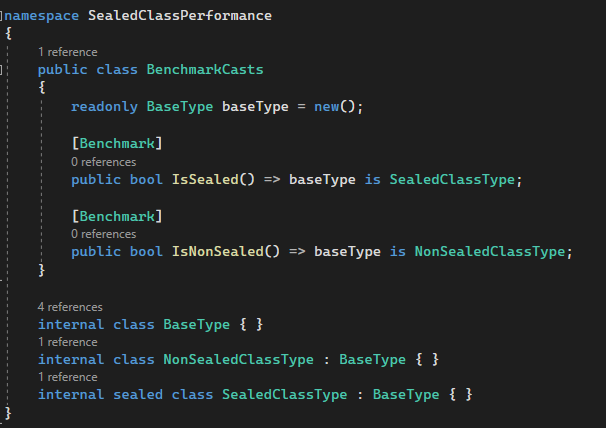
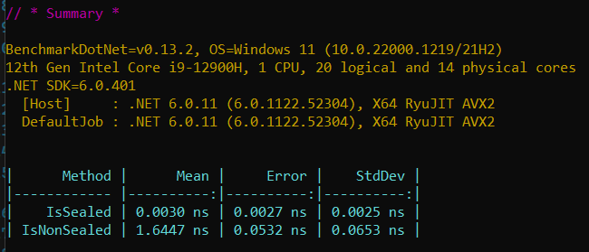

Traditionally you would only seal a class if you wanted to prevent it from being inherited. This is a good practice, but it's also a good practice to seal all classes by default and only unseal them when you need to inherit from them.

<!--endintro-->

On the surface it appears that you are just preventing someone from inheriting from your class, but there are a few other benefits to sealing your classes by default:

- Performance gains
- Only things that are designed to be inherited can be inheritable
- Inheritance can be easily abused and as a result is considered a minor anti-pattern
- Composition is preferred over inheritance

Watch this video by Nick Chapsas, to see the performance benefits of sealing your classes for different usage scenarios:

`youtube: https://www.youtube.com/embed/d76WWAD99Yo`
**Video: Why all your classes should be sealed by default in C# by Nick Chapsas (11 min)**

### Avoid unnecessary covariance checks in Array

Arrays in .NET are covariant. This means arrays enable implicit conversion of an array of a more derived type to an array of a less derived type. This operation is not type safe. To make sure it’s type safe JIT checks the type of the object before an item is assigned which is a performance cost.

When the array is an array of sealed types, JIT knows there won’t be any covariance involved when sealed types are used, so it skips covariance checks. This improves performance with arrays.

### Skip hierarchy checks of inheritance in runtime for is/as cast operations

During a cast operation, JIT needs to know the type of the object at runtime. When casting to a non-sealed type, the runtime must check all the types in the inheritance hierarchy, which can be time consuming.

When casting to a sealed type, the runtime only checks the type of the object. Hence the performance gain.

