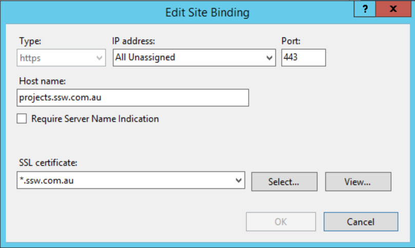

It is recommended to bind https by extending web applications in central admin site, rather than configuring in IIS

<!--endintro-->
<dl class="ssw15-rteElement-ImageArea"></dl>

::: bad
Bad example: Add https binding in IIS
:::

<dl class="ssw15-rteElement-ImageArea"></dl>

::: good
Good example: Extend web application and assign https to the Internet zone
:::
